# Kiến Trúc Hệ Thống Dezuxk AI Gateway (Hexagonal / Clean Architecture)

> **Mục tiêu:** Xây dựng khung kiến trúc chuẩn mực (Enterprise-grade, Modular, Maintainable), tuyệt đối **KHÔNG HARDCODE** dữ liệu cứng (không hardcode URL, không hardcode số nguyên magic numbers, không hardcode model, không hardcode tham số RPC). Mọi quy tắc và thông số đều được điều khiển qua **Configuration-Driven** và **Dynamic Registry Pattern**.

---

## 1. Nguyên Tắc Thiết Kế Cốt Lõi (Architecture Principles)

1. **Clean / Hexagonal Architecture (Ports & Adapters):**
   * Tách biệt hoàn toàn giữa **Nghiệp vụ cốt lõi (Domain & Use Cases)** và **Chi tiết kỹ thuật (HTTP Transport, Google Wire Protocol, Storage, Desktop UI)**.
   * Lớp Domain không phụ thuộc vào bất kỳ thư viện ngoài (Third-party framework) hay chi tiết máy chủ Google nào.
2. **Zero Hardcoded Data (Configuration & Dynamic Registry Driven):**
   * **Model Registry:** Không dùng `switch(model)` để gán cờ model. Mỗi model là một cấu hình động gồm: ID, BackendService, TierFlag, BaseCost, SupportedAspectRatios, Durations.
   * **Endpoint & RPC Registry:** Các RPC IDs (`nzlxg`, `cPZSdc`, `HTrJv`...), URL endpoints và Path templates được cấu hình tập trung trong Registry, cho phép cập nhật khi Google đổi RPC mà không cần sửa code nghiệp vụ.
   * **Form Marshalling Template:** Cấu trúc mảng 2 tầng `f.req` được mô hình hóa qua Template Builder, tham số vị trí được ánh xạ bằng Constant Enums rõ nghĩa, không chèn các mảng `[null, null, [0], 1, ...]` bừa bãi.
   * **Environment & Config:** Cổng mạng, User-Agent, Buffer Size, Timeouts, Quota Thresholds đều nạp từ file cấu hình `config.yaml` hoặc biến môi trường.
3. **Dependency Injection (IoC):**
   * Khởi tạo và liên kết các phụ thuộc (Dependencies) tại một điểm duy nhất (`wire` hoặc manual DI trong `cmd/`).
   * Dễ dàng viết Unit Test bằng cách mock các Ports/Interfaces mà không cần gọi mạng thật sang Google.

---

## 2. Sơ Đồ Kiến Trúc Phân Tầng (Hexagonal Layers)

```mermaid
flowchart TD
    subgraph DrivingAdapters ["Inbound / Driving Adapters (Đầu vào)"]
        HTTPHandler["OpenAI Compatible HTTP Handler (/v1/*)"]
        WailsBinding["Wails v2 Desktop Bridge (IPC)"]
        CLIDaemon["CLI / Headless Daemon Controller"]
    end

    subgraph InboundPorts ["Inbound Ports (Giao diện điều phối)"]
        ChatPort["ChatCompletionUseCase"]
        VideoPort["VideoGenerationUseCase"]
        ImagePort["ImageGenerationUseCase"]
        AccountPort["AccountManagementUseCase"]
    end

    subgraph DomainCore ["Domain Core (Nghiệp vụ thuần túy - Zero External Deps)"]
        ModelRegistry["Dynamic Model Registry"]
        RPCRegistry["Dynamic RPC & Endpoint Registry"]
        SessionEntity["Account & Session Entities"]
        CreditRule["Credit Calculation Engine"]
        MediaEntity["Media Asset Value Objects"]
    end

    subgraph OutboundPorts ["Outbound Ports (Giao diện hạ tầng)"]
        UpstreamPort["UpstreamGoogleClient"]
        SessionStorePort["SessionRepository"]
        MediaStorePort["MediaStorageRepository"]
        TokenExtractorPort["CSRFTokenExtractor"]
    end

    subgraph DrivenAdapters ["Outbound / Driven Adapters (Hạ tầng thực thi)"]
        GoogleTransport["Google Wire Transport (WAF Headers, Double-JSON)"]
        StreamParser["Line-Buffering & wrb.fr Stream Parser"]
        LocalFileStorage["Local Disk Media Storage (HTTP Range)"]
        ChromeCDP["Chrome DevTools Protocol (Port 9222 Sync)"]
        SQLiteRepo["SQLite / Memory Session Store"]
    end

    DrivingAdapters --> InboundPorts
    InboundPorts --> DomainCore
    DomainCore --> OutboundPorts
    OutboundPorts --> DrivenAdapters
```



---

## 3. Cấu Trúc Thư Mục Chuẩn Golang (Clean Directory Structure)

```
dezuxk-gateway/
├── cmd/
│   ├── gateway/                  # Entrypoint chế độ Wails Desktop GUI
│   │   └── main.go
│   └── daemon/                   # Entrypoint chế độ Headless Server / CLI
│       └── main.go
├── internal/
│   ├── core/
│   │   ├── domain/               # Thực thể nghiệp vụ thuần (Entities, DTOs)
│   │   │   ├── account.go        # Thực thể tài khoản & Cookie Jar
│   │   │   ├── model.go          # Định nghĩa mô hình động (Model Definition)
│   │   │   ├── rpc.go            # Định nghĩa RPC & Endpoint Descriptor
│   │   │   ├── media.go          # Siêu dữ liệu tài nguyên truyền thông
│   │   │   └── chat.go           # Cấu trúc hội thoại chuẩn hóa
│   │   ├── ports/                # Giao diện (Interfaces) giữa các tầng
│   │   │   ├── inbound.go        # UseCase interfaces (Chat, Video, Image)
│   │   │   └── outbound.go       # Repository & Upstream interfaces
│   │   └── services/             # Triển khai nghiệp vụ (Use Case Implementations)
│   │       ├── chat_service.go
│   │       ├── video_service.go
│   │       ├── account_service.go
│   │       └── media_service.go
│   ├── adapters/
│   │   ├── inbound/
│   │   │   ├── http/             # Router Chi/net-http phục vụ chuẩn OpenAI /v1/*
│   │   │   │   ├── router.go
│   │   │   │   ├── chat_handler.go
│   │   │   │   ├── video_handler.go
│   │   │   │   ├── model_handler.go
│   │   │   │   └── media_handler.go
│   │   │   └── wails/            # Go Bindings cho giao diện Wails Desktop
│   │   │       └── bindings.go
│   │   └── outbound/
│   │       ├── google/           # Client giao tiếp với Google
│   │       │   ├── transport.go  # WAF headers, TLS, HTTP/2 connection pool
│   │       │   ├── marshaller.go # Đóng gói double-JSON dựa trên schema động
│   │       │   ├── stream.go     # Bộ xử lý luồng wrb.fr, cắt dòng, SSE
│   │       │   └── handshake.go  # Trích xuất CSRF SNlM0e & cfb2h
│   │       ├── storage/          # Lưu trữ đĩa cứng cục bộ & Byte-Range
│   │       │   └── local_storage.go
│   │       └── session/          # Bộ nhớ tài khoản (Thread-safe memory / SQLite)
│   │           └── memory_repo.go
│   └── config/                   # Quản lý cấu hình tập trung (YAML/Env)
│       ├── config.go
│       └── defaults.go
├── configs/
│   └── config.example.yaml       # File mẫu cấu hình chi tiết
├── go.mod
├── go.sum
└── ARCHITECTURE.md
```

---

## 4. Cơ Chế "Không Hardcode" Chi Tiết (Anti-Hardcode Mechanisms)

### 4.1. Không Hardcode Model: Dùng Dynamic Model Registry

Mỗi mô hình được khai báo dưới dạng một đối tượng cấu hình (`ModelDescriptor`). Khi Google cập nhật mô hình mới (ví dụ `Gemini 4.0`), chỉ cần cập nhật danh mục cấu hình mà không cần sửa logic code:

```go
package domain

type ServiceKind string

const (
	ServiceGemini ServiceKind = "gemini"
	ServiceFlow   ServiceKind = "flow"
)

type ModelCapability string

const (
	CapChat  ModelCapability = "chat"
	CapImage ModelCapability = "image"
	CapVideo ModelCapability = "video"
	CapAudio ModelCapability = "audio"
)

// ModelDescriptor mô tả hoàn chỉnh một mô hình không cần hardcode trong mã
type ModelDescriptor struct {
	ID                 string            `json:"id" yaml:"id"`
	DisplayName        string            `json:"display_name" yaml:"display_name"`
	TargetService      ServiceKind       `json:"target_service" yaml:"target_service"`
	Capabilities       []ModelCapability `json:"capabilities" yaml:"capabilities"`
	InternalBackendID  string            `json:"internal_backend_id" yaml:"internal_backend_id"` // Ví dụ: "veo_3_1_quality", "abra"
	ModelTierCode      int               `json:"model_tier_code" yaml:"model_tier_code"`         // 1: Flash, 3: Pro
	CreditCostPerUnit  int               `json:"credit_cost_per_unit" yaml:"credit_cost_per_unit"`
	SupportedDurations []int             `json:"supported_durations" yaml:"supported_durations"` // [4, 6, 8, 10]
	SupportedAspects   []string          `json:"supported_aspects" yaml:"supported_aspects"`     // ["16:9", "9:16"]
	IsActive           bool              `json:"is_active" yaml:"is_active"`
}
```

---

### 4.2. Không Hardcode RPC: Dùng Dynamic RPC Descriptor Registry

Các RPC được quản lý theo danh mục tập trung:

```go
package domain

type RpcEndpoint struct {
	ID          string      `json:"id" yaml:"id"`                     // Ví dụ: "nzlxg", "Zzl0ze", "jHPbke"
	TargetHost  string      `json:"target_host" yaml:"target_host"`   // "flow.google.com" hoặc "gemini.google.com"
	PathPattern string      `json:"path_pattern" yaml:"path_pattern"` // "/_/AiSandboxAngularFrontend/data/batchexecute"
	Service     ServiceKind `json:"service" yaml:"service"`
	RequiresAt  bool        `json:"requires_at" yaml:"requires_at"`   // Cần token SNlM0e không
	Description string      `json:"description" yaml:"description"`
}
```

---

### 4.3. Không Hardcode Mảng Payload: Dùng Payload Template Builder

Thay vì ghép mảng 80 phần tử `[null, null, [0], 1, null, ...]`, Gateway sử dụng Builder Pattern với các thuộc tính rõ ràng:

```go
package domain

type GeminiChatPayloadBuilder struct {
	UserPrompt     string
	Locale         string
	ConversationID string
	ResponseID     string
	ChoiceID       string
	ModelTier      int
	EnableThinking bool
	ClientUUID     string
}

// BuildArray tự động xây dựng mảng đúng chỉ mục chuẩn mà không viết chuỗi JSON thô
func (b *GeminiChatPayloadBuilder) BuildArray() []interface{} {
	// Khởi tạo mảng với kích thước chuẩn
	slots := make([]interface{}, 105)
	
	// Gán các trường có ý nghĩa ngữ nghĩa
	slots[0] = []interface{}{b.UserPrompt, 0, nil, nil, nil, nil, 0}
	slots[1] = []interface{}{b.Locale}
	slots[2] = []interface{}{b.ConversationID, b.ResponseID, b.ChoiceID, nil, nil, nil, nil, nil, nil, ""}
	slots[6] = []interface{}{0}
	slots[7] = 1
	slots[10] = 1
	slots[11] = 0
	slots[17] = []interface{}{[]interface{}{0}}
	slots[18] = 0
	slots[27] = 1
	slots[30] = []interface{}{4}
	slots[41] = []interface{}{1}
	slots[53] = 0
	slots[59] = b.ClientUUID
	slots[61] = []interface{}{}
	slots[67] = 0
	slots[68] = 1
	slots[79] = b.ModelTier // 1: Flash, 3: Pro
	slots[80] = 1
	slots[91] = 0
	slots[96] = 0
	
	if b.EnableThinking {
		slots[98] = 1
	} else {
		slots[98] = 0
	}
	slots[100] = 1

	return slots
}
```

---

## 5. Luồng Dữ Liệu Chi Tiết (Data Flow Matrix)

| Bước | Thành phần phụ trách | Dữ liệu đầu vào | Thao tác thực hiện | Dữ liệu đầu ra |
| :---: | :--- | :--- | :--- | :--- |
| **1** | `inbound/http` | HTTP Request từ Client | Parse JSON OpenAI, validate auth key | `domain.ChatCompletionRequest` |
| **2** | `services.ChatService` | Domain Request | Tìm Account khả dụng, resolve ModelDescriptor | Gửi lệnh sang Outbound Port |
| **3** | `outbound/google.Marshaller`| Domain Request + AtToken | Dựng mảng `slots`, đóng gói 2 lớp JSON `f.req` | `url.Values` Form Body |
| **4** | `outbound/google.Transport` | Form Body + CookieJar | Inject bộ 6 Headers WAF, gửi HTTP/2 POST | `http.Response` (Chunked wrb.fr) |
| **5** | `outbound/google.Stream` | Raw Chunked Body | Line Buffer, gọt `)]}'\n`, decode `wrb.fr` | Text Token Delta Stream |
| **6** | `inbound/http` | Token Delta | Đóng gói JSON OpenAI `chat.completion.chunk` | Server-Sent Events (SSE) `data: {...}` |

---

## 6. Kiểm Thử Độc Lập (Testability & Mocking)

Nhờ kiến trúc Hexagonal với Interfaces phân lập:
* **Unit Test:** Kiểm thử toàn bộ nghiệp vụ Chat, Video, Account Routing bằng `mock_ports.go` mà không cần internet.
* **Contract Test:** Kiểm thử độc lập phần mã hóa Double-JSON với các payload mẫu đã ghi nhận từ Google trong `docs-2`.
* **Integration Test:** Kiểm thử toàn diện từ HTTP Handler đến Mock Upstream server chạy tại localhost.

---

## 7. Cơ Chế Khởi Động Sạch & Phân Lập Profile (Clean Standby & Profile Isolation)

### 7.1. Cấu Hình Hạ Tầng Thuần Túy (Zero Upstream Pollution)
File `configs/config.yaml` được thiết kế hoàn toàn sạch, **tuyệt đối không chứa bất kỳ thông tin nào liên quan đến Gemini, Flow hay mô hình AI**. Cấu hình chỉ bao gồm các tham số máy chủ (Host, Port, API Key), thư mục Profile (`profiles.base_dir`), và đường dẫn lưu trữ media.

### 7.2. Trạng Thái Chờ Ban Đầu (Server Standby State)
* Khi Gateway khởi động:
  * `ModelRegistry` khởi tạo rỗng (`len == 0`).
  * `GET /health` trả về `{"status":"ok","models_active":0}`.
  * `GET /v1/models` trả về `{"object":"list","data":[]}` (danh sách mô hình rỗng).
  * Gọi `/v1/chat/completions` khi chưa có tài khoản nào đăng nhập sẽ lập tức trả về mã lỗi HTTP 503 (`google_account_not_logged_in`).

### 7.3. Phân Lập Thư Mục Profile Chrome Từng Tài Khoản
* Mỗi tài khoản Google được cấp một thư mục riêng biệt tại `./profiles/<profile_id>/`.
* Khi kích hoạt đăng nhập, Chrome được khởi chạy với cờ `--user-data-dir="<path_to_profile>"` và `--remote-debugging-port=<cdp_port>`.
* Toàn bộ Cookie SQLite, Local Storage, Cache, và cấu hình Chrome được lưu trữ hoàn toàn cô lập trong thư mục này, không xảy ra xung đột hay nhiễm chéo giữa các tài khoản.

### 7.4. Đổ Dữ Liệu Sau Khi Đăng Nhập (Dynamic Catalog Pour-Out)
* Sau khi người dùng hoàn tất đăng nhập Google trên Chrome:
  1. Gateway kết nối qua Chrome CDP WebSocket hoặc nhận cookie nạp trực tiếp qua API `/v1/profiles/{id}/sync` hoặc `/v1/profiles/{id}/ingest`.
  2. Gateway kiểm tra các cookie xác thực bắt buộc (`__Secure-1PSID`, `__Secure-1PSIDTS` cho Gemini; `OSID`, `__Secure-OSID` cho Flow).
  3. Gateway thực hiện Handshake lấy CSRF token `SNlM0e`.
  4. **Chỉ khi các điều kiện trên thỏa mãn**, Gateway mới kích hoạt các danh mục mô hình tương ứng (`domain.GetGeminiCatalog()`, `domain.GetFlowCatalog()`) vào `ModelRegistry`.
  5. Dữ liệu bắt đầu được đổ ra: `GET /v1/models` hiển thị đầy đủ danh sách model và Gateway sẵn sàng xử lý các yêu cầu suy luận AI.

---

## 8. Kiến Trúc Ứng Dụng Desktop (Wails v2 Desktop GUI)

### 8.1. Mô Hình Single Binary Hybrid
Ứng dụng desktop đóng gói toàn bộ Gateway Server và giao diện người dùng thành một file thực thi duy nhất (`dezuxk-desktop.exe`):
* **Background Goroutine:** Chạy HTTP Server Gateway chuẩn OpenAI tại `http://127.0.0.1:8080/v1`.
* **Native Desktop Window:** Hiển thị Webview2 với giao diện chuẩn Theme Trắng (Light Theme) hiện đại, kết nối trực tiếp với Go qua Wails IPC Bindings.

### 8.2. Phân Chia Module Mã Nguồn (Modular File Breakdown)
Tuyệt đối không dồn code vào một file duy nhất, hệ thống phân rã thành các module chuyên biệt:

* **Go Backend Layer:**
  * `main.go`: Khởi động Gateway HTTP server, nạp config, cấu hình Wails window options.
  * `app.go`: Định nghĩa struct App trung tâm và các lifecycle hooks (`startup`, `shutdown`).
  * `app_profiles.go`: Xử lý CRUD profile, mở Chrome riêng biệt (`--user-data-dir`), đồng bộ cookie CDP.
  * `app_models.go`: Truy xuất trạng thái máy chủ (`GetServerStatus`) và danh mục mô hình đang kích hoạt (`GetActiveModels`).
  * `app_chat.go`: Xử lý prompt thử nghiệm cho AI Playground (`SendTestChat`).
  * `app_logs.go`: Bộ đệm Ring Buffer (`LogBuffer`) lưu trữ 300 request mạng gần nhất để vẽ lên UI theo thời gian thực.

* **Frontend UI Layer (`frontend/`):**
  * `index.html`: Khung bố cục Semantic (Sidebar, Header, Tab Panes, Modals, Toast Container).
  * `src/css/`: Hệ thống style Theme Trắng (Light Theme) gồm 8 file:
    * `variables.css`: Design tokens nền trắng, slate borders, primary blue, status pills.
    * `base.css`: Typography, layout container, custom scrollbars.
    * `sidebar.css`: Thanh điều hướng, status dot phát sáng, nút copy nhanh URL.
    * `components.css`: Buttons, badges, form inputs, modal overlays, toasts.
    * `profiles.css`: Lưới thẻ Card tài khoản Google, avatar, nút hành động.
    * `models.css`: Bảng mô hình kích hoạt, capability tags, endpoint box.
    * `playground.css`: Giao diện chat AI, bong bóng tin nhắn, thanh nhập prompt.
    * `logs.css`: Bảng giám sát traffic mạng và HTTP status codes.
  * `src/js/`: Logic điều khiển module hóa:
    * `state.js`: Quản lý trạng thái UI tập trung.
    * `bridge.js`: Đóng gói an toàn các lời gọi Wails IPC Go bindings.
    * `toast.js`: Hệ thống thông báo toast tự biến mất.
    * `tabs/profiles.js`: Điều khiển giao diện quản lý profile Google.
    * `tabs/models.js`: Điều khiển danh mục mô hình & copy endpoint.
    * `tabs/playground.js`: Điều khiển phòng thử nghiệm chat AI.
    * `tabs/logs.js`: Điều khiển bảng nhật ký request thời gian thực.
    * `app.js`: Điểm vào chính, chuyển đổi tab và vòng lặp tự động đồng bộ (3 giây).


