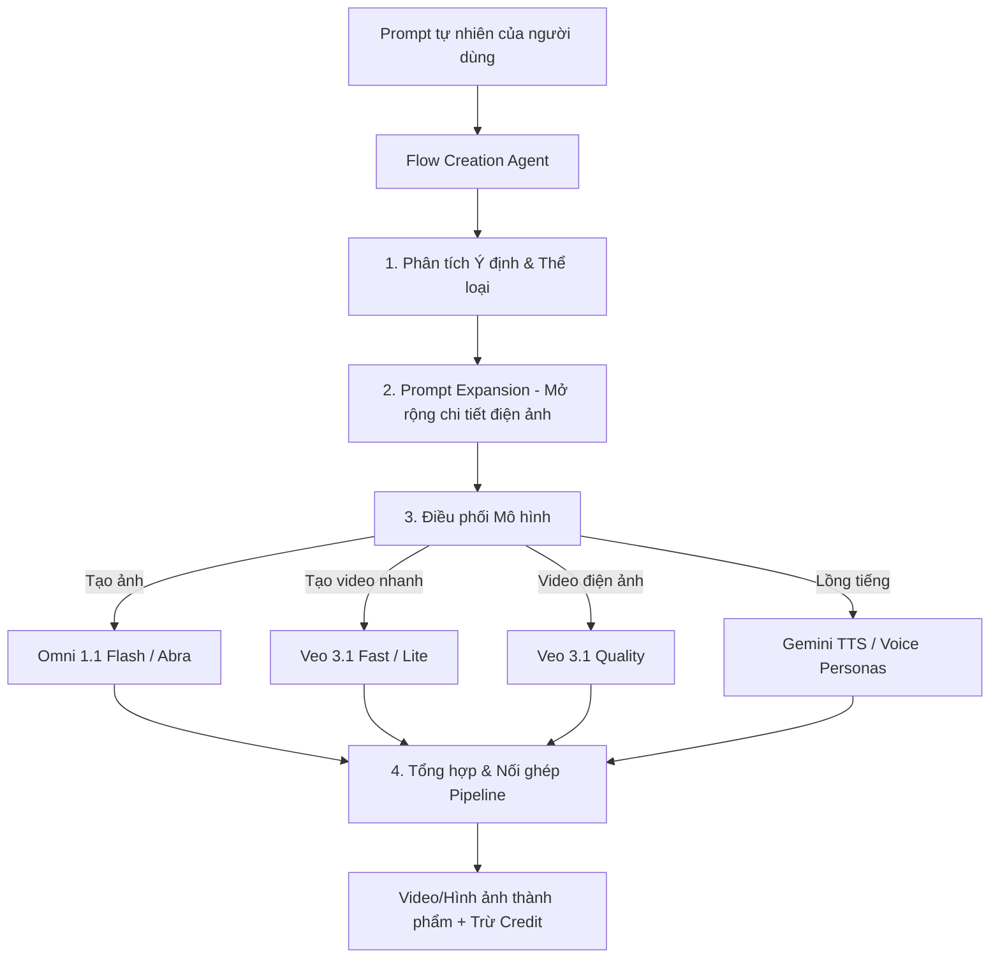

# Chức năng: Tác nhân Sáng tạo AI & Điều phối Đa mô hình (Agent & Capabilities)

Chức năng của **Flow Creation Agent** – tác nhân trí tuệ nhân tạo điều phối toàn diện môi trường Google Flow thông qua dịch vụ `FlowCreationAgentService/StreamChat`.

---

## 1. Thông tin Endpoint & Giao thức Agent

* **Endpoint:** `POST https://flow.google.com/_/AiSandboxAngularFrontend/data/google.internal.labs.aisandbox.proto.flow.agent.v1.FlowCreationAgentService/StreamChat`
* **Content-Type:** `application/x-www-form-urlencoded;charset=UTF-8`
* **Cơ chế:** Giao thức kết nối luồng phân đoạn (Chunked Event Stream).

---

## 2. Các Chức năng Cốt lõi của Tác nhân (Agent Capabilities)

Thay vì yêu cầu người dùng phải tự cấu hình từng thông số đồ họa phức tạp, Agent đảm nhận các vai trò thông minh sau:



### 2.1. Phân tích Ý định & Tự động Lập kế hoạch (Planning & Reasoning)
* Agent phân tích câu lệnh tiếng tự nhiên của người dùng để xác định loại sản phẩm đầu ra (ảnh tĩnh, video ngắn, hoạt hình, âm nhạc).
* Tự động quyết định mô hình nào tối ưu nhất về chất lượng và chi phí credit cho người dùng.

### 2.2. Mở rộng Câu lệnh Điện ảnh (Prompt Expansion)
* Khi người dùng nhập prompt ngắn (ví dụ: *"Một thành phố cyberpunk"*), Agent tự động bổ sung các từ khóa chuyên ngành điện ảnh (ánh sáng thể tích *volumetric lighting*, góc máy *wide-angle drone shot*, tông màu *teal and orange grading*, thời gian *golden hour*).

### 2.3. Điều phối Chuỗi Xử lý Nhiều Bước (Multi-step Chaining)
* Tạo ảnh tham chiếu trước bằng Imagen 3 (`abra`).
* Đưa ảnh này làm khung hình bắt đầu (`i2v`) vào Veo 3.1 để sinh chuyển động.
* Tự động gọi mô hình `veo_3_1_upsampler_1080p` để nâng độ nét lên Full HD.
* Ghép tệp âm thanh lời thoại từ một trong 30 Voice Personas có sẵn.

---

## 3. Cấu trúc Payload Điều khiển Agent

```json
[
  null,
  "[\"request_uuid_v4\", [[[[ \"Tạo video một phi hành gia bước đi trên bề mặt sao Hỏa lúc hoàng hôn, camera lia dần từ chân lên mặt trời lặn\" ]]]], [\"projects/project_uuid_v4\", null, [\"client_session_state_token\", 1], null, null, 1]]"
]
```

### Dữ liệu Server Agent truyền về thời gian thực:
1. **Thông điệp trò chuyện trung gian:** Agent giải thích các bước nó đang thực hiện (*"Tôi đang khởi tạo khung hình đầu tiên và chuẩn bị cụm GPU Veo 3.1..."*).
2. **Thao tác tạo node:** Các lệnh RPC tạo các khối công cụ tương ứng trên canvas của dự án.
3. **Mã LRO theo dõi:** Giám sát tiến độ render trên server.
4. **Kết quả kết xuất:** Trả về liên kết video/ảnh sau khi Agent đã kiểm tra chất lượng an toàn (Safety Evaluation).
