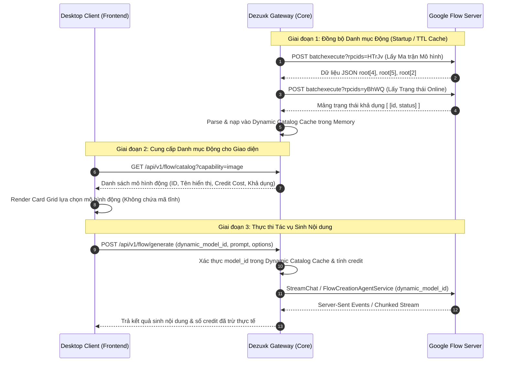

# Kiến trúc & Quy trình: Khám phá & Quản lý Mô hình Động (Dynamic Model Discovery Specification)

Tài liệu này quy định kiến trúc và phương thức trích xuất danh mục mô hình tạo ảnh, tạo video và bộ nâng cấp (upsamplers) từ máy chủ Google Flow.

---

> [!IMPORTANT]
> **Nguyên tắc Bất biến (Zero-Hardcoding Policy):**
> Tuyệt đối **KHÔNG ĐƯỢC GÁN CỨNG (HARDCODE)** bất kỳ tên model, mã định danh nội bộ hay mức tiêu tốn credit nào trong mã nguồn Backend, Frontend hoặc cấu hình tĩnh.
> Toàn bộ danh mục mô hình, tên hiển thị, năng lực kỹ thuật và chi phí credit phải được **khám phá động (Dynamic Discovery)** và **phân giải tại thời điểm chạy (Runtime Resolution)** thông qua các RPC của Google Flow.

---

## 1. Phương Thức Trích Xuất Mô Hình Động (Dynamic Model Extraction)

Google Flow quản lý và cung cấp danh mục mô hình cùng chính sách hạn mức thông qua 2 RPC cốt lõi:
1. **RPC `HTrJv` (Model Matrix & Credit Schema):** Bóc tách toàn bộ cây mô hình, phiên bản, thời lượng, tỷ lệ khung hình và bảng giá credit theo từng Tier tài khoản.
2. **RPC `yBhWQ` (Model Active Status):** Xác định danh sách các mô hình đang trực tuyến (Online/Available) trên hạ tầng GPU của Google.

### 1.1. Bóc Tách Ma Trận Mô Hình (RPC `HTrJv`)

* **Endpoint:** `POST https://flow.google.com/_/AiSandboxAngularFrontend/data/batchexecute?rpcids=HTrJv`
* **Content-Type:** `application/x-www-form-urlencoded;charset=UTF-8`
* **Header bắt buộc:** `X-Same-Domain: 1`, Cookie phiên hợp lệ (`OSID`, `__Secure-OSID`, `__Secure-1PSID`, `__Secure-1PSIDTS`).
* **Payload Request:**
  ```http
  f.req=[[["HTrJv","[]",null,"generic"]]]&at=<SNlM0e_TOKEN>
  ```

#### Quy trình giải mã phong bì dữ liệu (Envelope Unwrapping):
Phản hồi từ Google sử dụng tiền tố bảo vệ XSSI `)]}'\n\n`. Thuật toán bóc tách dữ liệu gốc:
1. Tìm vị trí dấu `[` đầu tiên để loại bỏ chuỗi `)]}'`.
2. Parse JSON tầng 1 thu được mảng phong bì `[ ["wrb.fr", "HTrJv", "<INNER_JSON_STRING>", ...] ]`.
3. Trích xuất chuỗi JSON tại vị trí `parsedEnvelope[0][2]`.
4. Parse JSON tầng 2 thu được mảng gốc `root` (`data[0]`).

---

## 2. Cấu Trúc Cây Dữ Liệu Máy Chủ (`root` Node Array)

Mảng gốc `root = data[0]` phân bổ các khối dữ liệu theo chỉ mục:

| Vị trí Chỉ mục | Khối Dữ Liệu | Mục Đích Kỹ Thuật |
| :---: | :--- | :--- |
| `root[2]` | **User Tier Model Mapping** | Bản đồ gán mô hình mặc định theo phân hạng tài khoản (`Tier 1`, `Tier 2`, `Tier 3`). |
| `root[3]` | **Model Family Mappings** | Bảng ánh xạ 53+ biến thể nội bộ về các nhóm gia đình mô hình cấp cao. |
| `root[4]` | **Video & Multimodal Models** | Danh mục mô hình sinh video, mở rộng cảnh và inpainting/chỉnh sửa. |
| `root[5]` | **Image Models & Upsamplers** | Danh mục toàn bộ mô hình tạo ảnh, chuyển đổi style và bộ nâng cấp độ phân giải. |
| `root[7]` | **Audio & TTS Engines** | Danh mục công cụ tổng hợp âm thanh và giọng đọc tự động. |

---

## 3. Thuật Toán Trích Xuất & Phân Giải Mô Hình Tạo Ảnh Động (`root[5]`)

Duyệt tuần tự các phần tử trong danh sách `root[5]`:

```text
root[5] -> Array of Model Entities
  └─ item[0]: Display Name (Tên hiển thị động trên UI của Google)
  └─ item[1]: Variants Array (Danh sách biến thể kỹ thuật & biểu phí credit)
  └─ item[2]: IsDefault / Capability Flag (boolean/null)
  └─ item[3]: Internal Backend ID (Mã định danh duy nhất gửi lên API sinh ảnh)
```

### Thuật toán phân giải chi phí Credit Động theo Tier:
Với mỗi mô hình `item` trong `root[5]`, chi phí credit được xác định động qua cấu trúc:
```text
credit_matrix = item[1][0][4]  // Mảng phân cấp theo Tier tài khoản
```

Cấu trúc mỗi phần tử trong `credit_matrix`:
```json
[
  tier_number,       // 1 = Free Tier, 2 = Standard Tier, 3 = Pro Tier
  [ [ null, cost ] ] // cost: Giá trị credit tiêu tốn (số nguyên >= 0)
]
```

* **Quy tắc phân giải chi phí:**
  1. Lấy `user_tier` hiện tại của tài khoản người dùng (từ RPC `nzlxg`).
  2. Tra cứu phần tử trong `credit_matrix` có `tier_number === user_tier`.
  3. Nếu `cost === 0` hoặc mảng rỗng `[]` $\rightarrow$ Mô hình có trạng thái **`Miễn phí (0 Credit)`**.
  4. Nếu `cost > 0` $\rightarrow$ Mô hình tiêu tốn **`cost credits`** trên mỗi lượt sinh.
  5. Nếu người dùng chọn số lượng sinh $x$ ($x \in [1, 2, 3, 4]$) $\rightarrow$ Tổng chi phí động = $\text{cost} \times x$.

---

## 4. Thuật Toán Trích Xuất & Phân Giải Mô Hình Tạo Video Động (`root[4]`)

Duyệt tuần tự các phần tử trong danh sách `root[4]`:

```text
root[4] -> Array of Video Model Groups
  └─ group[0]: Group Display Name (Tên nhóm mô hình video động)
  └─ group[1]: Array of Capabilities & Durations
       └─ variant[0]: Capability Task ID (vd: t2v, i2v, r2v, extend, reshoot)
       └─ variant[4]: Credit Matrix theo Tier tài khoản
       └─ variant[14]: Tỷ lệ / Giới hạn khung hình
       └─ variant[16]: Thời lượng video hỗ trợ (giây: 4, 6, 8, 10...)
```

* **Quy tắc phân giải video:**
  * Lọc danh sách biến thể theo `Task Type` (`Text-to-Video`, `Image-to-Video`, `Reference-to-Video`).
  * Chi phí credit được lấy động từ `variant[4]` tương ứng với thời lượng (`duration`) và độ phân giải được chọn.

---

## 5. Xác Minh Trạng Thái Khả Dụng Động (RPC `yBhWQ`)

* **Endpoint:** `POST https://flow.google.com/_/AiSandboxAngularFrontend/data/batchexecute?rpcids=yBhWQ`
* **Payload Request:**
  ```http
  f.req=[[["yBhWQ","[]",null,"generic"]]]&at=<SNlM0e_TOKEN>
  ```
* **Cấu trúc phản hồi:**
  ```json
  [
    ["<backend_model_id_1>", 1],
    ["<backend_model_id_2>", 1],
    ["<backend_model_id_3>", 0]
  ]
  ```
* **Quy tắc kiểm tra:**
  * Giá trị `1`: Mô hình đang khả dụng và cụm GPU sẵn sàng nhận tác vụ.
  * Giá trị `0` hoặc không có trong danh sách: Mô hình tạm thời ngoại tuyến hoặc bảo trì, Gateway tự động ẩn hoặc vô hiệu hóa lựa chọn trên giao diện.

---

## 6. Kiến Trúc Áp Dụng Động Trên Hệ Thống Dezuxk



### 6.1. Nguyên tắc triển khai Backend Go:
1. `CatalogService` định kỳ hoặc theo chu kỳ phiên làm việc gửi RPC `HTrJv` và `yBhWQ` để nạp danh mục mô hình vào cấu trúc `DynamicCatalogStore`.
2. Hàm tiền kiểm tra `prepare()` không so khớp với hằng số tĩnh mà kiểm tra sự tồn tại của `model_id` trong `DynamicCatalogStore.ActiveModels`.
3. Chi phí trừ tín dụng được tra cứu từ bảng giá động tương ứng với gói tài khoản hiện thời.

### 6.2. Nguyên tắc triển khai Frontend UI:
1. HTML Subtab Image và Video không tạo sẵn các thẻ option tĩnh với tên cố định.
2. JavaScript gọi API `/api/v1/flow/catalog` để lấy danh sách mô hình thời gian thực.
3. Tạo phần tử DOM động:
   * Tên mô hình hiển thị: Lấy từ thuộc tính `display_name` của server.
   * Huy hiệu chi phí: Nếu `cost_credits === 0` hiển thị `Miễn phí`, ngược lại hiển thị `${cost_credits} credits`.
   * Giá trị gửi đi: Gán `data-model-id` bằng `backend_id` động của server.
