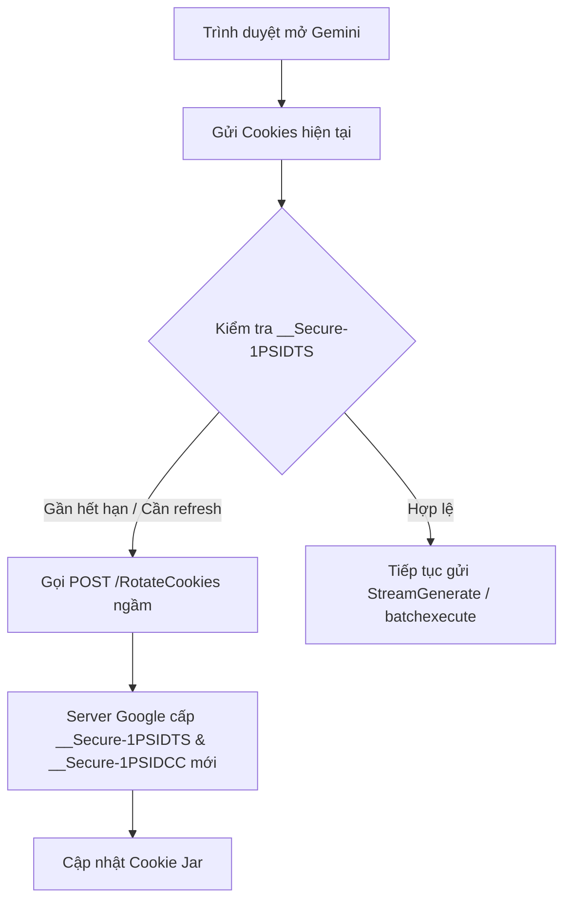

# Phân tích Cookie, Vòng đời Dữ liệu & Cơ chế Phòng chống Bot trên Google Gemini Web

Tài liệu này phân tích chi tiết cơ chế bảo mật, định danh, vòng đời cookie và các biện pháp chống bot/spam của máy chủ Google Gemini (`gemini.google.com`) được thu thập từ phiên Chrome thực tế qua Chrome DevTools Protocol.

---

## 1. Danh mục Cookie & Cơ chế Định danh Phiên

| Tên Cookie | Domain | Nguồn gốc tạo | Thời hạn (Lifecycle) | Tần suất Refresh | Mục đích bảo mật & Nhận diện |
| :--- | :--- | :--- | :--- | :--- | :--- |
| `__Secure-1PSID` | `.google.com` | **Server** | Dài hạn (~1 - 2 năm) | Ổn định, ít thay đổi | Cookie phiên đăng nhập chính (`HttpOnly`, `Secure`). Dùng để xác thực danh tính người dùng Google. |
| `__Secure-1PSIDTS` | `.google.com` | **Server** | Trung hạn (~1 năm) | **Liên tục (Từng giờ / Request)** | Time-stamped Session Security Token. Được cập nhật liên tục qua endpoint `https://accounts.google.com/RotateCookies` để chống Replay Attack. |
| `__Secure-3PSID` | `.google.com` | **Server** | Dài hạn (~1 - 2 năm) | Ổn định | Phiên bản 3rd-party (`SameSite=None`) cho các widget nhúng của Google. |
| `SID` | `.google.com` | **Server** | Dài hạn (~1 - 2 năm) | Ổn định | Định danh session Google không bảo mật bắt buộc HTTPS. |
| `HSID` | `.google.com` | **Server** | Dài hạn (~1 - 2 năm) | Ổn định | Chữ ký điện tử đối soát IP và tài khoản (`HttpOnly`). |
| `SSID` | `.google.com` | **Server** | Dài hạn (~1 - 2 năm) | Ổn định | Khóa bảo mật truyền tải qua kết nối HTTPS (`Secure`, `HttpOnly`). |
| `SAPISID` | `.google.com` | **Server** | Dài hạn (~1 - 2 năm) | Ổn định | **Client sử dụng để băm:** Dùng để tạo header `Authorization: SAPISIDHASH <timestamp>_<sha1>` cho các API Google nội bộ. |
| `__Secure-1PAPISID` | `.google.com` | **Server** | Dài hạn (~1 - 2 năm) | Ổn định | Biến thể bảo mật của SAPISID trong môi trường HTTPS. |
| `SIDCC` | `.google.com` | **Server** | Ngắn hạn (~1 năm) | **Từng request / Phiên** | Security Challenge Cookie, đối soát tính toàn vẹn của trình duyệt. |
| `__Secure-1PSIDCC` | `.google.com` | **Server** | Ngắn hạn (~1 năm) | **Từng request / Phiên** | Phiên bản HTTPS của `SIDCC`. Thay đổi liên tục khi có request gửi lên. |
| `COMPASS` | `.gemini.google.com` | **Server** | **Rất ngắn hạn (~10 ngày)** | **Xoay tua định kỳ** | Cookie giám sát hành vi và chống bot độc quyền riêng cho tên miền `gemini.google.com`. |
| `NID` | `.google.com` | **Server** | ~6 tháng | Định kỳ | Cookie ghi nhớ tùy chọn tài khoản và phân phối máy chủ Google. |
| `_ga`, `_ga_*` | `.gemini.google.com` | **Client (JS)** | 1 - 2 năm | Khi có sự kiện | Cookie Google Analytics phía client, sinh bởi thư viện tracking. |
| `_gcl_au` | `.gemini.google.com` | **Client (JS)** | ~3 tháng | Khi có sự kiện | Cookie phân bổ chuyển đổi Google Tag. |

---

## 2. Vòng đời Cookie: Client-set vs Server-set & Cơ chế Refresh



1. **Dữ liệu được tạo từ Server:**
   * Toàn bộ các cookie mang cờ `HttpOnly`: `__Secure-1PSID`, `__Secure-1PSIDTS`, `HSID`, `SSID`, `SIDCC`, `COMPASS`.
   * Client hoàn toàn không thể đọc hoặc tự sinh các cookie này qua JavaScript (`document.cookie`).
2. **Dữ liệu được tạo từ Client:**
   * Các chuỗi băm `SAPISIDHASH` tính toán động trong bộ nhớ RAM từ `SAPISID` + `Origin` + `Timestamp`.
   * Các cookie đo kiểm: `_ga`, `_gcl_au`.
3. **Cơ chế Refresh liên tục:**
   * `__Secure-1PSIDTS`: Google thực hiện xoay vòng token này rất thường xuyên. Nếu client gọi API với `__Secure-1PSIDTS` quá cũ, Google sẽ gửi header `Set-Cookie` để gia hạn hoặc trả mã lỗi buộc trình duyệt kích hoạt iframe `/RotateCookies`.
   * `__Secure-1PSIDCC` / `SIDCC`: Cập nhật dấu thời gian kiểm tra bảo mật sau mỗi chuỗi request nghiệp vụ.

---

## 3. Dữ liệu cần có trong Request để tránh Bot, Spam & Google Chặn

Để một request từ môi trường bên ngoài (Node.js / Python / Go) được Google chấp nhận mà không bị kích hoạt hệ thống WAF/Anti-bot:

### 3.1. CSRF Token `SNlM0e`
* Mỗi phiên làm việc gắn liền với một token CSRF mang tên mã `SNlM0e`.
* Nằm trong payload `window.WIZ_global_data.SNlM0e` của trang HTML chính.
* Bắt buộc phải đính kèm trong tham số form `at=<SNlM0e>` ở mọi request `StreamGenerate` và `batchexecute`.
* Nếu token này không khớp với cookie `__Secure-1PSID`, server sẽ trả lỗi ngay lập tức mà không xử lý model.

### 3.2. Bộ Headers Browser Fingerprinting (Sec-CH-UA & Sec-Fetch)
Google WAF kiểm tra rất nghiêm ngặt bộ headers chuẩn của trình duyệt Chromium:
```http
Sec-CH-UA: "Not?A_Brand";v="99", "Google Chrome";v="151", "Chromium";v="151"
Sec-CH-UA-Mobile: ?0
Sec-CH-UA-Platform: "Linux"
Sec-Fetch-Dest: empty
Sec-Fetch-Mode: cors
Sec-Fetch-Site: same-origin
X-Same-Domain: 1
Origin: https://gemini.google.com
Referer: https://gemini.google.com/app
```
> **Cảnh báo chống Bot:** Nếu thiếu `X-Same-Domain: 1` hoặc `Sec-Fetch-Site: same-origin`, server sẽ từ chối request với mã lỗi HTTP 403 Forbidden.

### 3.3. Xử lý Rate Limit & Backoff
* Google áp dụng thuật toán Token Bucket / Leaky Bucket theo dõi theo tài khoản và IP.
* Khi gửi quá nhanh, server trả về chuỗi text `RATE_LIMIT` trong chunk streaming hoặc HTTP 429.
* Cần duy trì jitter ngẫu nhiên giữa các request (khoảng 1.2s - 2.8s) để mô phỏng nhịp tương tác tự nhiên của con người.
