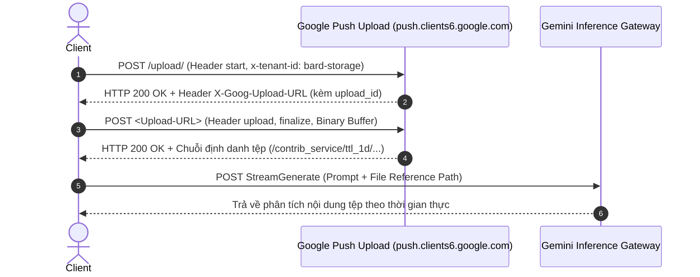

# Chức năng: Tải lên Tệp & Tài liệu Đa phương thức (Uploads)

Google Gemini sử dụng hạ tầng đẩy tệp nhị phân phân tán thông qua **Google Push Upload Service** (`push.clients6.google.com`) với giao thức Resumable Upload và định danh lưu trữ riêng biệt `bard-storage`.

---

## 1. Quy trình Giao tiếp 2 bước của Máy chủ



---

## 2. Bước 1: Khởi tạo Phiên Tải lên (Start Handshake)

* **Endpoint:** `POST https://push.clients6.google.com/upload/`
* **Cookie cần thiết:** `__Secure-1PSID`, `__Secure-1PSIDTS`.
* **Headers bắt buộc:**
  ```http
  X-Tenant-Id: bard-storage
  Push-Id: feeds/mcudyrk2a4khkz
  X-Goog-Upload-Command: start
  X-Goog-Upload-Protocol: resumable
  X-Goog-Upload-Header-Content-Length: <kích_thước_tệp_bytes>
  Content-Type: application/x-www-form-urlencoded;charset=UTF-8
  Origin: https://gemini.google.com
  Referer: https://gemini.google.com/
  ```
* **Dữ liệu Server trả về:**
  * Header HTTP: `X-Goog-Upload-URL: https://push.clients6.google.com/upload/?upload_id=<uuid>&upload_protocol=resumable`
  * Header HTTP: `X-Goog-Upload-Chunk-Granularity: 2097152` (2MB/chunk).

---

## 3. Bước 2: Tải lên & Chốt Tệp (Upload & Finalize)

* **Endpoint:** URL nhận được từ header `X-Goog-Upload-URL`.
* **Headers:**
  ```http
  X-Tenant-Id: bard-storage
  X-Goog-Upload-Command: upload, finalize
  X-Goog-Upload-Offset: 0
  Content-Type: application/x-www-form-urlencoded;charset=utf-8
  Referer: https://gemini.google.com/
  ```
* **Body:** Binary payload của file ảnh/tài liệu.
* **Dữ liệu Server xử lý và phản hồi:**
  Server kiểm tra tính toàn vẹn, quét virus, gán chính sách lưu trữ tạm 24 giờ (`ttl_1d`) và trả về chuỗi đường dẫn lưu trữ nội bộ:
  ```text
  /contrib_service/ttl_1d/pjsmt5sej3lgm746nb4oc4stqeyjr21790170983_AR5BTA7SVLeLRJ36Joz95HDe0V8JO1U-xWwC8NDHAPTuqW05X60KSuF-ZEPv
  ```

---

## 4. Bước 3: Đính kèm Đường dẫn Tệp vào Prompt Chat

Chuỗi định danh `/contrib_service/ttl_1d/...` được truyền trực tiếp vào mảng tệp đính kèm trong payload `f.req` của `StreamGenerate`:

```json
[
  null,
  "[[\"Phân tích bức ảnh này\", 0, null, [[[\"/contrib_service/ttl_1d/...\", 1]]], null, null, 0], [\"vi\"], ...]"
]
```
Máy chủ Gemini tự động nạp tensor hình ảnh/tài liệu từ hệ thống lưu trữ phân tán để thực hiện suy luận đa phương thức.
