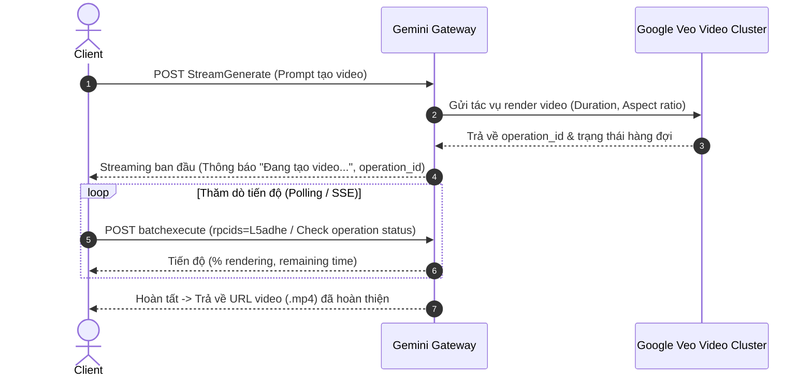

# Chức năng: Tạo Video Trực tiếp qua Chat Prompt (Video Generation)

Tương tự như chức năng tạo ảnh, Google Gemini Web tích hợp mô hình tạo video **Veo** trực tiếp vào luồng trò chuyện mà không cần giao diện riêng.

---

## 1. Cơ chế Hoạt động

Khi người dùng gửi các câu lệnh như:
* *"Tạo một video 5 giây cảnh sóng biển vỗ vào bờ cát lúc bình minh"*
* *"Generate a short video clip of a drone flying through misty mountains"*

* **Endpoint:** `POST https://gemini.google.com/_/BardChatUi/data/assistant.lamda.BardFrontendService/StreamGenerate`
* **Cookie cần thiết:** `__Secure-1PSID`, `__Secure-1PSIDTS`.
* Hệ thống máy chủ Gemini LLM nhận diện ý định `Text-to-Video` và kích hoạt đường ống xử lý Veo ngầm.

---

## 2. Quy trình Xử lý Video Bất đồng bộ (Async LRO)

Do quá trình render video tốn nhiều thời gian (thường từ 20 đến 90 giây tùy độ dài), server không giữ một kết nối HTTP đồng bộ đơn lẻ mà xử lý theo mô hình tác vụ chạy nền (Long Running Operation):



---

## 3. Cấu trúc Dữ liệu Server trả về

### 3.1. Phản hồi ban đầu (Initial Task Acknowledgment)
Server trả về mã tác vụ video:
```json
[
  "rc_choice_id",
  ["Đang tạo video của bạn bằng Veo..."],
  null,
  null,
  null,
  [
    {
      "operation_id": "operations/video_gen_1234567890abcdef",
      "model": "veo_video_generation",
      "duration_seconds": 5,
      "status": "PROCESSING",
      "preview_image_url": "https://lh3.googleusercontent.com/gg-bard-images/placeholder.jpg"
    }
  ]
]
```

### 3.2. Phản hồi khi Render hoàn tất (Final Completed Video)
Khi tác vụ hoàn thành, luồng trả về URL tệp video chính thức:
```json
{
  "status": "SUCCESS",
  "video_url": "https://video.google.com/generated_media/veo_output_12345.mp4",
  "mime_type": "video/mp4",
  "resolution": "1280x720",
  "duration_seconds": 5.0,
  "fps": 24
}
```

---

## 4. Điều kiện & Giới hạn Tài khoản
* Tính năng tạo video yêu cầu tài khoản có gói **Google One AI Premium** hoặc tài khoản thử nghiệm Google Labs được cấp phép.
* Đối với tài khoản thông thường, server sẽ trả về câu phản hồi giải thích tính năng chưa khả dụng trên phân vùng hoặc gói cước hiện tại.
