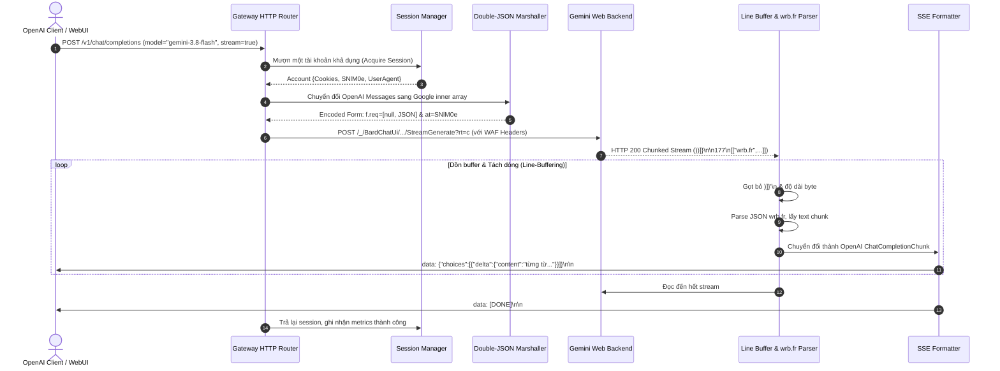

# Module 01: Kiến Trúc Tổng Thể & Thiết Kế Module Hệ Thống (System Architecture)

> Tài liệu đặc tả cấu trúc phần mềm, phân chia gói mã nguồn Go (Package Layout), luồng điều khiển dữ liệu và các giao diện (Interfaces) cốt lõi của Dezuxk AI Gateway.

---

## 1. Cấu Trúc Mã Nguồn Golang Chuẩn (Standard Go Project Layout)

```
dezuxk/
├── build/                      # Tài nguyên build Wails (icons, manifest Windows)
├── cmd/
│   ├── gateway/                # Entrypoint cho chế độ Wails Desktop GUI
│   │   └── main.go
│   └── daemon/                 # Entrypoint cho chế độ Headless Server / CLI
│       └── main.go
├── frontend/                   # Giao diện Wails Desktop (HTML/CSS/JS)
│   ├── src/
│   │   ├── index.html
│   │   ├── main.js
│   │   └── style.css
│   └── package.json
├── internal/
│   ├── app/                    # Khởi tạo runtime, Wails App lifecycle
│   │   ├── app.go
│   │   └── bindings.go         # Các hàm Go export cho JavaScript gọi
│   ├── config/                 # Đọc, ghi và watch file config.yaml
│   │   └── config.go
│   ├── server/                 # HTTP Ingress Server (Router Chi/Gin)
│   │   ├── router.go
│   │   ├── middleware.go       # Auth Bearer token, CORS, Request Logger
│   │   └── handlers/
│   │       ├── chat.go         # /v1/chat/completions
│   │       ├── models.go       # /v1/models
│   │       ├── images.go       # /v1/images/generations
│   │       ├── audio.go        # /v1/audio/speech
│   │       ├── video.go        # /v1/video/* (Veo 3.1 & Extensions)
│   │       └── media.go        # /v1/media/* (Static File Proxy)
│   ├── session/                # Quản lý Cookie Jar, Token SNlM0e, Multi-Account
│   │   ├── manager.go
│   │   ├── account.go
│   │   ├── rolling.go          # Tự động cập nhật __Secure-1PSIDTS
│   │   └── handshake.go        # Fetch SNlM0e và cfb2h từ Google HTML
│   ├── gemini/                 # Client giao tiếp với Google Gemini Web
│   │   ├── client.go
│   │   ├── marshaller.go       # Đóng gói form f.req 2 tầng cho Gemini
│   │   ├── stream.go           # Parse wrb.fr, trích xuất c_, r_, rc_
│   │   └── rpc.go              # MaZiqc, cZOhpc, PCck7e, VxUbXb, whPPme
│   ├── flow/                   # Client giao tiếp với Google Flow Studio
│   │   ├── client.go
│   │   ├── project.go          # jHPbke, UpteDb, mrlkwd
│   │   ├── session_lock.go     # csbIsb
│   │   ├── pinhole.go          # ngNC2, kF8z7b, jE2m9c, dL5p2
│   │   ├── veo.go              # StreamChat Veo 3.1 & Extension
│   │   ├── abra.go             # Imagen 3 & Inpainting
│   │   └── credits.go          # nzlxg, cPZSdc, HTrJv
│   ├── media/                  # Hệ thống tải ngầm & cache CDN video/ảnh
│   │   ├── downloader.go
│   │   ├── storage.go
│   │   └── cleaner.go          # TTL retention cleaner
│   └── protocol/               # Cấu trúc dữ liệu OpenAI DTOs & Google Wire Envelopes
│       ├── openai_types.go
│       └── google_types.go
├── go.mod
├── go.sum
└── wails.json                  # Cấu hình Wails v2
```

---

## 2. Luồng Xử Lý Yêu Cầu Chi Tiết (Request Pipeline Flow)

### 2.1. Luồng Chat Streaming (`POST /v1/chat/completions` với `stream: true`)



---

## 3. Các Giao Diện (Interfaces) Cốt Lõi Bằng Golang

### 3.1. Session Interface (`internal/session/manager.go`)

```go
package session

import (
	"context"
	"net/http"
)

type ServiceType string

const (
	ServiceGemini ServiceType = "gemini"
	ServiceFlow   ServiceType = "flow"
)

// Account đại diện cho một danh tính Google đã đăng nhập
type Account struct {
	ID          string            `json:"id"`
	Email       string            `json:"email"`
	Cookies     map[string]string `json:"cookies"`     // OSID, __Secure-1PSID, __Secure-1PSIDTS...
	SNlM0e      string            `json:"snlm0e"`      // CSRF token trích xuất thời gian thực
	CFB2H       string            `json:"cfb2h"`       // Build label của Google backend
	UserAgent   string            `json:"user_agent"`  // Phải khớp với Chrome trích xuất cookie
	Credits     int               `json:"credits"`     // Số dư tín dụng Flow (từ RPC nzlxg)
	Tier        int               `json:"tier"`        // Phân hạng tài khoản (1: Free, 2: Pro)
	IsHealthy   bool              `json:"is_healthy"`
	LastRefresh int64             `json:"last_refresh"`
}

// Manager quản lý vòng đời và xoay vòng nhiều tài khoản
type Manager interface {
	// Lấy tài khoản tối ưu theo chiến lược (Round-robin, Least-used, Credit-aware)
	AcquireAccount(ctx context.Context, service ServiceType) (*Account, error)
	
	// Trả lại tài khoản sau khi thực thi xong request
	ReleaseAccount(account *Account, err error)
	
	// Làm mới CSRF token và đồng bộ Set-Cookie rolling
	RefreshSession(ctx context.Context, accountID string) error
	
	// Inject headers chống WAF bắt buộc vào request gửi sang Google
	ApplyHeaders(req *http.Request, account *Account, service ServiceType)
}
```

### 3.2. Marshaller Interface (`internal/gemini/marshaller.go`)

```go
package gemini

// ChatRequest đại diện cho tham số đầu vào được chuẩn hóa
type ChatRequest struct {
	Prompt         string
	ConversationID string // c_... (rỗng nếu là chat mới)
	ResponseID     string // r_... (rỗng nếu là chat mới)
	ChoiceID       string // rc_... (rỗng nếu là chat mới)
	ContextBlob    string // null nếu là chat mới
	Locale         string // "vi", "en"
	ModelTier      int    // 1: Flash, 3: Pro
	EnableThinking bool   // true: Bật Extended Thinking
}

// Marshaller đóng gói payload 2 tầng theo đúng định dạng Google Wire Protocol
type Marshaller interface {
	BuildFormPayload(req *ChatRequest, atToken string) (postData string, err error)
}
```

### 3.3. Stream Processor Interface (`internal/server/stream.go`)

```go
package server

import (
	"io"
	"net/http"
)

// StreamProcessor xử lý đọc luồng wrb.fr từ Google và đẩy SSE về Client
type StreamProcessor interface {
	ProcessStream(
		ctx context.Context,
		upstreamBody io.ReadCloser,
		clientWriter http.ResponseWriter,
		flusher http.Flusher,
		modelID string,
	) error
}
```

---

## 4. Nguyên Tắc Thiết Kế Bất Biến (Design Principles)

1. **Zero-External Dependency Cho Core Routing:**
   * Gateway Core không phụ thuộc vào bất kỳ service trung gian đám mây nào khác ngoài máy chủ Google. Toàn bộ logic chạy 100% On-Premises / Localhost.
2. **Goroutine-Safe & Connection Pooling:**
   * Sử dụng `sync.RWMutex` cho Session Store.
   * `http.Client` tái sử dụng `http.Transport` dùng chung với `MaxIdleConns: 100`, `IdleConnTimeout: 90 * time.Second` để duy trì Keep-Alive TCP TLS handshake với Google.
3. **Graceful Degradation:**
   * Nếu tính năng Extended Thinking bị lỗi hoặc hết quota, Gateway tự động fallback sang `Gemini 3.8 Flash` thay vì trả lỗi ngắt kết nối cho Client.
