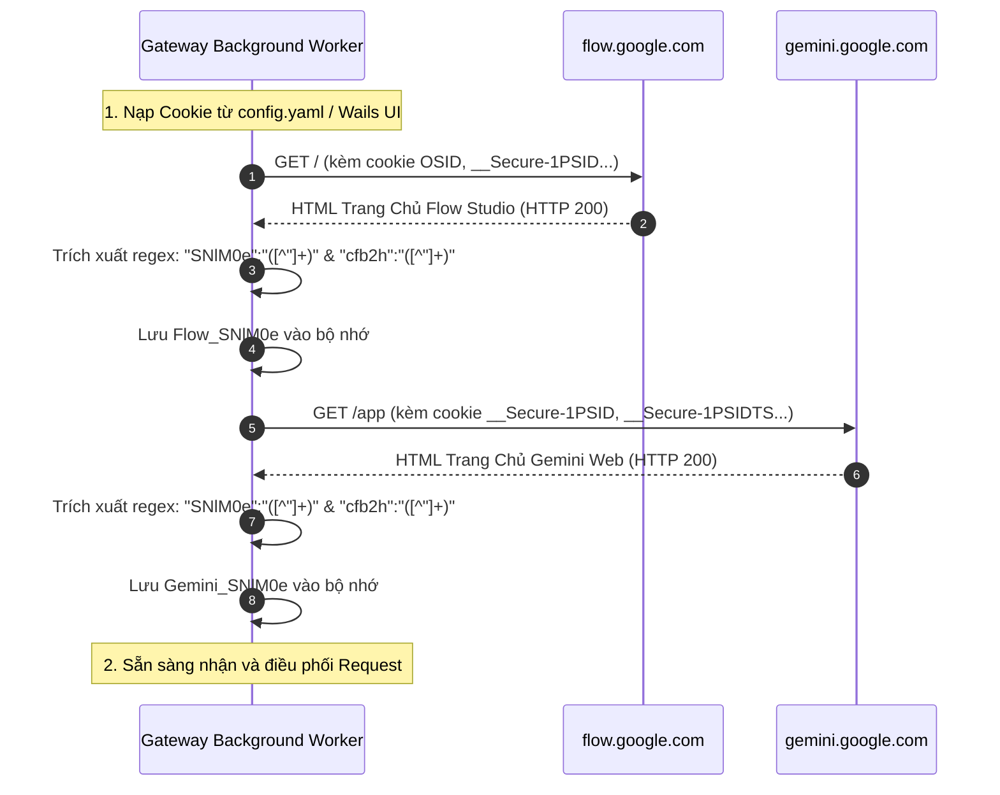

# Module 02: Quản Lý Phiên, Cookie & Multi-Account Pool (Authentication & Session Pool)

> Tài liệu đặc tả cơ chế nạp Cookie, phân lập Domain, tự động bắt tay (Handshake) lấy token CSRF `SNlM0e`, xử lý xoay vòng token thời gian `__Secure-1PSIDTS` và quản trị hồ tài khoản (Account Pool) trong Golang.

---

## 1. Yêu Cầu Cookie & Cơ Chế Phân Lập Domain (Domain-Bound Cookies)

Theo kết quả kiểm thử thực tế từ [docs-2/CRITICAL_INTEGRATION_GUIDE.md](file:///d:/nhathao/AI/dezuxk/docs-2/CRITICAL_INTEGRATION_GUIDE.md):

| Nhóm Cookie | Tên Cookie | Domain Áp Dụng | Tính Chất | Bắt Buộc Cho |
| :--- | :--- | :--- | :--- | :--- |
| **Google Master ID** | `__Secure-1PSID` | `.google.com` | Định danh tài khoản chủ, sống 1-2 năm | Cả Gemini & Flow |
| **Rolling Timestamp**| `__Secure-1PSIDTS` | `.google.com` | Token chống replay, **xoay vòng mỗi vài giờ** | Cả Gemini & Flow |
| **Session Integrity** | `__Secure-1PSIDCC` | `.google.com` | Token kiểm soát tính toàn vẹn phiên | Cả Gemini & Flow |
| **Flow Origin-Bound**| `OSID` | `flow.google.com` | Định danh phiên làm việc của Flow Studio | **Bắt buộc cho Flow** |
| **Flow High-Security**| `__Secure-OSID` | `flow.google.com` | Phiên bản bảo mật truyền tải qua HTTPS | **Bắt buộc cho Flow** |
| **Gemini Behavioral** | `COMPASS` | `.google.com` | Token giám sát luồng truy cập riêng của Bard/Gemini | Khuyến nghị cho Gemini |

> ⚠️ **BẪY LỖI SỐNG CÒN:** Không gửi cookie `OSID` sang domain `gemini.google.com` và ngược lại không được để thiếu `OSID`/`__Secure-OSID` khi gọi `flow.google.com`. Nếu thiếu, máy chủ Flow sẽ trả về HTTP 401 hoặc chuyển hướng về `accounts.google.com`.

---

## 2. Quy Trình Khởi Tạo & Handshake Token CSRF (`SNlM0e`)

Google không dùng Bearer Token chuẩn mà xác thực qua cặp `Cookie + at (SNlM0e)`. Gateway cần thực hiện handshake khi khởi động hoặc định kỳ:



### Mã Golang Thực Hiện Handshake (`internal/session/handshake.go`):

```go
package session

import (
	"context"
	"fmt"
	"io"
	"net/http"
	"regexp"
	"time"
)

var (
	reSNlM0e = regexp.MustCompile(`"SNlM0e":"([^"]+)"`)
	reCFB2H  = regexp.MustCompile(`"cfb2h":"([^"]+)"`)
)

type HandshakeResult struct {
	SNlM0e string
	CFB2H  string
}

// FetchTokens truy cập trang chủ Google với Cookie đã nạp để trích xuất SNlM0e và cfb2h
func FetchTokens(ctx context.Context, client *http.Client, targetURL string, cookieHeader string, userAgent string) (*HandshakeResult, error) {
	req, err := http.NewRequestWithContext(ctx, http.MethodGet, targetURL, nil)
	if err != nil {
		return nil, err
	}

	req.Header.Set("User-Agent", userAgent)
	req.Header.Set("Cookie", cookieHeader)
	req.Header.Set("Accept", "text/html,application/xhtml+xml,application/xml;q=0.9,*/*;q=0.8")
	req.Header.Set("Accept-Language", "vi,en-US;q=0.9,en;q=0.8")

	resp, err := client.Do(req)
	if err != nil {
		return nil, fmt.Errorf("handshake request failed: %w", err)
	}
	defer resp.Body.Close()

	if resp.StatusCode != http.StatusOK {
		return nil, fmt.Errorf("google returned HTTP %d for %s", resp.StatusCode, targetURL)
	}

	// Đọc body HTML (Google trang chủ có kích thước khoảng 500KB - 2MB)
	bodyBytes, err := io.ReadAll(resp.Body)
	if err != nil {
		return nil, fmt.Errorf("read body failed: %w", err)
	}
	bodyStr := string(bodyBytes)

	matchSN := reSNlM0e.FindStringSubmatch(bodyStr)
	if len(matchSN) < 2 {
		return nil, fmt.Errorf("SNlM0e token not found in HTML response of %s", targetURL)
	}

	cfb2h := ""
	matchCFB := reCFB2H.FindStringSubmatch(bodyStr)
	if len(matchCFB) >= 2 {
		cfb2h = matchCFB[1]
	}

	return &HandshakeResult{
		SNlM0e: matchSN[1],
		CFB2H:  cfb2h,
	}, nil
}
```

---

## 3. Tự Động Xoay Vòng Token Thời Gian (`__Secure-1PSIDTS`)

Mỗi khi gửi bất kỳ request nào lên Google, máy chủ có thể trả về Header `Set-Cookie` chứa giá trị mới của `__Secure-1PSIDTS`. Nếu Gateway bỏ qua header này, session sẽ chết sau khoảng 6 - 24 giờ.

### Thuật Toán Cập Nhật Cookie Tự Động:

```go
package session

import (
	"net/http"
	"strings"
	"sync"
)

type CookieJar struct {
	mu      sync.RWMutex
	cookies map[string]string
}

func NewCookieJar(rawCookies map[string]string) *CookieJar {
	cj := &CookieJar{cookies: make(map[string]string)}
	for k, v := range rawCookies {
		cj.cookies[k] = v
	}
	return cj
}

// IngestResponseCookies bắt các cookie được Google xoay vòng qua Set-Cookie
func (cj *CookieJar) IngestResponseCookies(cookies []*http.Cookie) bool {
	cj.mu.Lock()
	defer cj.mu.Unlock()

	updated := false
	for _, c := range cookies {
		switch c.Name {
		case "__Secure-1PSIDTS", "__Secure-1PSIDCC", "SIDCC", "COMPASS":
			if c.Value != "" && cj.cookies[c.Name] != c.Value {
				cj.cookies[c.Name] = c.Value
				updated = true
			}
		}
	}
	return updated
}

// GetCookieHeader xuất chuỗi định dạng cho Header Request theo Domain
func (cj *CookieJar) GetCookieHeader(isFlow bool) string {
	cj.mu.RLock()
	defer cj.mu.RUnlock()

	var sb strings.Builder
	for name, val := range cj.cookies {
		// Chỉ đưa OSID và __Secure-OSID vào request Flow
		if (name == "OSID" || name == "__Secure-OSID") && !isFlow {
			continue
		}
		if sb.Len() > 0 {
			sb.WriteString("; ")
		}
		sb.WriteString(name)
		sb.WriteString("=")
		sb.WriteString(val)
	}
	return sb.String()
}
```

---

## 4. Kiến Trúc Multi-Account Pool & Cân Bằng Tải (Load Balancer)

Gateway hỗ trợ quản lý nhiều tài khoản Google đồng thời để:
1. **Tránh lỗi 429 Too Many Requests:** Giãn tải trên nhiều tài khoản cho Gemini.
2. **Tối ưu hạn mức Credit Flow:** Tự động định tuyến các tác vụ Veo đắt đỏ (100 credits) sang tài khoản có số dư lớn nhất.

### 4.1. Cấu Trúc Đối Tượng Tài Khoản

```go
type ManagedAccount struct {
	ID             string
	Email          string
	Jar            *CookieJar
	FlowSNlM0e     string
	GeminiSNlM0e   string
	UserAgent      string
	CreditsBalance int       // Cập nhật từ RPC nzlxg
	Tier           int       // 1: Free, 2: Pro
	InFlightReqs   int64     // Số request đang xử lý song song
	CooldownUntil  time.Time // Thời điểm hết bị phạt (khi gặp 429)
}
```

### 4.2. Chiến Lược Tuyển Chọn Tài Khoản (Selection Strategies)

* **Strategy 1: Least-In-Flight (Dành cho Gemini Chat):**
  Chọn tài khoản đang có ít request xử lý nhất và không bị cooldown.
* **Strategy 2: Credit-Aware Routing (Dành cho Flow Video / Veo):**
  * Tác vụ Veo Quality (100 credits): Chỉ gán cho tài khoản có `CreditsBalance >= 100`.
  * Tác vụ Veo Fast (20 credits): Gán cho tài khoản có `CreditsBalance >= 20`.
  * Sau mỗi lượt tạo video thành công, Gateway tự động trừ dự toán số dư cục bộ trước khi đồng bộ lại từ RPC `nzlxg`.

### 4.3. Circuit Breaker & Exponential Backoff Cho HTTP 429

Khi Google trả về `HTTP 429 Too Many Requests`:
1. Đánh dấu tài khoản hiện tại vào trạng thái `Cooldown` trong `60s * 2^retryCount`.
2. Tự động thử lại request trên một tài khoản khác trong Pool mà client không hề bị gián đoạn kết nối.
3. Bắn event cảnh báo lên giao diện Wails Desktop để người dùng theo dõi.
