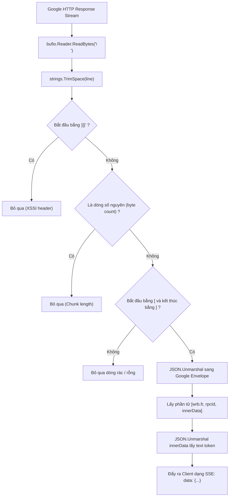

# Module 05: Xử Lý Luồng Streaming & Wire Protocol Trong Golang (Streaming & Wire Protocol)

> Tài liệu đặc tả kỹ thuật xử lý luồng mạng (TCP Chunked Stream), bộ đệm ghép dòng (Line Buffering), giải mã lớp bảo vệ XSSI `)]}'\n`, bóc tách mảng Google `wrb.fr` và chuyển đổi sang chuẩn Server-Sent Events (SSE) trong Golang.

---

## 1. Bản Chất Wire Protocol Của Google

Khi gửi yêu cầu có tham số `rt=c`, máy chủ Google không trả về một cục JSON duy nhất mà truyền tải theo cơ chế **HTTP Chunked Streaming**.

### 1.1. Cấu Trúc Khung Dữ Liệu Thô (Raw Wire Format)

```text
)]}'\n
\n
177\n
[["wrb.fr",null,"[null,[\"c_37442807c1368987\",\"r_7f6f8ceb4a7bf989\"],{\"18\":\"r_7f6f8ceb4a7bf989\"...]]"]]
\n
1718\n
[["wrb.fr",null,"[null,[\"c_37442807c1368987\",\"r_7f6f8ceb4a7bf989\"],null,null,[[\"rc_4a38a969d4b9d819\",[\"Pong! Connection loud and clear...\"],...]]]]"]]
\n
```

### 1.2. Các Thành Phần Cần Xử Lý Bóc Tách:
1. **Tiền tố XSSI Protection (`)]}'\n`):** Chuỗi bảo vệ chống tấn công Cross-Site Script Inclusion, bắt buộc phải loại bỏ trước khi parse JSON.
2. **Dòng độ dài byte (`177\n`, `1718\n`):** Máy chủ chèn các số nguyên đại diện cho độ dài của chunk tiếp theo trên từng dòng riêng biệt. Cần bỏ qua các dòng chỉ chứa số nguyên này (`^\d+$`).
3. **Phân mảnh gói tin TCP (Packet Fragmentation):** Một dòng JSON `[["wrb.fr", ...]]` có độ dài hàng nghìn ký tự. Khi truyền qua tầng mạng TCP, nó thường bị xé vụn thành nhiều gói tin nhỏ. **Nếu parse JSON ngay lập tức khi đọc từng chunk mạng, chương trình sẽ crash với lỗi `unexpected end of JSON input`.**

---

## 2. Thuật Toán Bộ Đệm Ghép Dòng (Line-Buffering Algorithm Trong Go)

Gateway sử dụng `bufio.Reader` kết hợp `bytes.Buffer` để dồn dữ liệu cho đến khi gặp ký tự xuống dòng `\n` trọn vẹn:



---

## 3. Mã Nguồn Golang Bộ Xử Lý Stream Chuẩn (`internal/gemini/stream.go`)

```go
package gemini

import (
	"bufio"
	"bytes"
	"context"
	"encoding/json"
	"fmt"
	"io"
	"net/http"
	"regexp"
	"strings"
	"time"
)

var digitOnlyRegex = regexp.MustCompile(`^\d+$`)

// OpenAIChunkPayload định dạng chuẩn trả về cho client SSE
type OpenAIChunkPayload struct {
	ID      string         `json:"id"`
	Object  string         `json:"object"`
	Created int64          `json:"created"`
	Model   string         `json:"model"`
	Choices []OpenAIChoice `json:"choices"`
}

type OpenAIChoice struct {
	Index        int         `json:"index"`
	Delta        OpenAIDelta `json:"delta"`
	FinishReason *string     `json:"finish_reason"`
}

type OpenAIDelta struct {
	Content string `json:"content,omitempty"`
}

// StreamToSSE đọc luồng Google wrb.fr và chuyển tiếp thành SSE OpenAI
func StreamToSSE(
	ctx context.Context,
	upstream io.ReadCloser,
	w http.ResponseWriter,
	flusher http.Flusher,
	modelID string,
) error {
	defer upstream.Close()

	reader := bufio.NewReaderSize(upstream, 64*1024) // Buffer 64KB
	createdTime := time.Now().Unix()
	var conversationID string
	var lastText string

	for {
		select {
		case <-ctx.Done():
			return ctx.Err()
		default:
		}

		line, err := reader.ReadBytes('\n')
		if len(line) > 0 {
			lineStr := strings.TrimSpace(string(line))

			// Bỏ qua dòng rỗng, XSSI protection và độ dài byte
			if lineStr == "" || strings.HasPrefix(lineStr, ")]}'") || digitOnlyRegex.MatchString(lineStr) {
				continue
			}

			// Chỉ xử lý khi dòng là mảng JSON hợp lệ
			if strings.HasPrefix(lineStr, "[") && strings.HasSuffix(lineStr, "]") {
				tokenText, convID, isDone := extractTextFromEnvelope(lineStr)
				if convID != "" {
					conversationID = convID
				}

				if tokenText != "" && tokenText != lastText {
					// Bóc tách phần văn bản mới tăng thêm (Delta)
					var delta string
					if strings.HasPrefix(tokenText, lastText) {
						delta = tokenText[len(lastText):]
					} else {
						delta = tokenText
					}
					lastText = tokenText

					if delta != "" {
						chunk := OpenAIChunkPayload{
							ID:      "chatcmpl-" + conversationID,
							Object:  "chat.completion.chunk",
							Created: createdTime,
							Model:   modelID,
							Choices: []OpenAIChoice{
								{
									Index: 0,
									Delta: OpenAIDelta{
										Content: delta,
									},
									FinishReason: nil,
								},
							},
						}
						chunkBytes, _ := json.Marshal(chunk)
						fmt.Fprintf(w, "data: %s\n\n", chunkBytes)
						flusher.Flush()
					}
				}

				if isDone {
					break
				}
			}
		}

		if err != nil {
			if err == io.EOF {
				break
			}
			return err
		}
	}

	// Gửi chunk kết thúc [DONE]
	stopReason := "stop"
	finalChunk := OpenAIChunkPayload{
		ID:      "chatcmpl-" + conversationID,
		Object:  "chat.completion.chunk",
		Created: createdTime,
		Model:   modelID,
		Choices: []OpenAIChoice{
			{
				Index:        0,
				Delta:        OpenAIDelta{},
				FinishReason: &stopReason,
			},
		},
	}
	finalBytes, _ := json.Marshal(finalChunk)
	fmt.Fprintf(w, "data: %s\n\n", finalBytes)
	fmt.Fprintf(w, "data: [DONE]\n\n")
	flusher.Flush()

	return nil
}

// extractTextFromEnvelope bóc tách wrb.fr và giải mã inner JSON
func extractTextFromEnvelope(rawLine string) (text string, convID string, isDone bool) {
	var envelope [][]interface{}
	if err := json.Unmarshal([]byte(rawLine), &envelope); err != nil {
		return "", "", false
	}

	for _, item := range envelope {
		if len(item) >= 3 && item[0] == "wrb.fr" {
			innerStr, ok := item[2].(string)
			if !ok || innerStr == "" {
				continue
			}

			var inner []interface{}
			if err := json.Unmarshal([]byte(innerStr), &inner); err != nil {
				continue
			}

			// Bóc tách Conversation ID tại inner[1][0]
			if len(inner) > 1 {
				if metaArray, ok := inner[1].([]interface{}); ok && len(metaArray) > 0 {
					if cID, ok := metaArray[0].(string); ok && strings.HasPrefix(cID, "c_") {
						convID = cID
					}
				}
			}

			// Bóc tách Candidate Text tại inner[4][0][1][0]
			if len(inner) > 4 && inner[4] != nil {
				if candidates, ok := inner[4].([]interface{}); ok && len(candidates) > 0 {
					if candidate, ok := candidates[0].([]interface{}); ok && len(candidate) > 1 {
						if textParts, ok := candidate[1].([]interface{}); ok && len(textParts) > 0 {
							if partStr, ok := textParts[0].(string); ok {
								text = partStr
							}
						}
					}
				}
			}
		}
	}

	return text, convID, false
}
```

---

## 4. Tối Ưu Hiệu Năng & Quản Lý Bộ Nhớ (Zero-Copy & Memory Pool)

1. **Tái Sử Dụng Buffer (`sync.Pool`):**
   * Trong Golang, việc liên tục cấp phát mảng byte cho các luồng stream dài sẽ tạo gánh nặng lớn cho Garbage Collector (GC).
   * Gateway áp dụng `sync.Pool` chứa các `bytes.Buffer` kích thước 64KB để tái sử dụng giữa các lượt kết nối SSE.
2. **Kích Hoạt `X-Accel-Buffering: no`:**
   * Header này giúp ngăn Nginx hoặc Reverse Proxy phía trước Gateway dồn buffer, đảm bảo từng từ được hiển thị ngay lập tức trên giao diện người dùng theo thời gian thực (Zero Latency Streaming).
