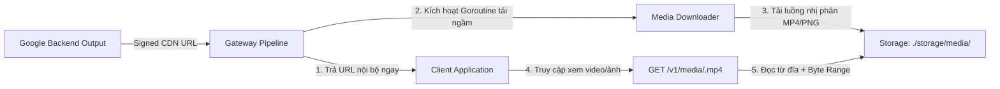

# Module 06: Lưu Trữ Cục Bộ & Proxy Tải Media (Media Proxy & Disk Caching)

> Tài liệu đặc tả hệ thống tải ngầm (Background Downloader), bộ nhớ đệm đĩa cứng (Disk Cache) và máy chủ truyền thông nội bộ (`/v1/media/*`), giải quyết triệt để rủi ro link CDN Google hết hạn sau 12 - 24 giờ.

---

## 1. Rủi Ro Kỹ Thuật: Thời Gian Sống Tạm Thời Của Google CDN (Signed URLs TTL)

Theo [docs-2/CRITICAL_INTEGRATION_GUIDE.md](file:///d:/nhathao/AI/dezuxk/docs-2/CRITICAL_INTEGRATION_GUIDE.md):
* Tất cả URL hình ảnh (`https://lh3.googleusercontent.com/...`) và video (`https://storage.googleapis.com/flow-rendered-videos/...`) trả về từ Google đều là **Pre-Signed URLs có chữ ký số điện tử kèm thời hạn**.
* **Thời gian tồn tại tối đa:** Từ **12 đến 24 giờ** (thể hiện qua marker `ttl_1d`).
* **Hậu quả:** Sau 24 giờ, mở lại liên kết sẽ bị Google từ chối với lỗi `HTTP 403 Access Denied`. Nếu lưu trực tiếp URL này vào cơ sở dữ liệu làm việc lâu dài, toàn bộ tài nguyên hình ảnh/video sẽ bị mất vĩnh viễn.

---

## 2. Kiến Trúc Pipeline Lưu Trữ & Phân Phối Cục Bộ



---

## 3. Cấu Trúc Mã Nguồn Golang Media Engine (`internal/media/`)

### 3.1. Đối Tượng Siêu Dữ Liệu Tệp (Asset Metadata)

```go
package media

import (
	"time"
)

type MediaType string

const (
	TypeImagePNG MediaType = "image/png"
	TypeImageJPG MediaType = "image/jpeg"
	TypeVideoMP4 MediaType = "video/mp4"
	TypeAudioWAV MediaType = "audio/wav"
)

type MediaAsset struct {
	ID          string    `json:"id"`           // Ví dụ: vid_4a89bc12
	FileName    string    `json:"file_name"`    // vid_4a89bc12.mp4
	FilePath    string    `json:"file_path"`    // Đường dẫn tuyệt đối trên đĩa
	OriginalURL string    `json:"original_url"` // Pre-signed URL Google ban đầu
	ContentType MediaType `json:"content_type"`
	SizeBytes   int64     `json:"size_bytes"`
	CreatedAt   time.Time `json:"created_at"`
	IsReady     bool      `json:"is_ready"`     // Đã tải xong về đĩa chưa
}
```

### 3.2. Trình Tải Ngầm Tự Động (Background Downloader)

```go
package media

import (
	"context"
	"fmt"
	"io"
	"net/http"
	"os"
	"path/filepath"
	"sync"
	"time"
)

type StorageManager struct {
	mu       sync.RWMutex
	baseDir  string
	baseURL  string
	assets   map[string]*MediaAsset
	client   *http.Client
}

func NewStorageManager(baseDir string, baseURL string) (*StorageManager, error) {
	if err := os.MkdirAll(baseDir, 0755); err != nil {
		return nil, fmt.Errorf("failed to create media storage dir: %w", err)
	}

	return &StorageManager{
		baseDir: baseDir,
		baseURL: baseURL,
		assets:  make(map[string]*MediaAsset),
		client:  &http.Client{Timeout: 5 * time.Minute},
	}, nil
}

// IngestURL đăng ký tài nguyên và kích hoạt tải ngầm
func (sm *StorageManager) IngestURL(originalURL string, mediaType MediaType, ext string) (*MediaAsset, string) {
	sm.mu.Lock()
	defer sm.mu.Unlock()

	assetID := fmt.Sprintf("asset_%d", time.Now().UnixNano())
	fileName := fmt.Sprintf("%s.%s", assetID, ext)
	filePath := filepath.Join(sm.baseDir, fileName)

	asset := &MediaAsset{
		ID:          assetID,
		FileName:    fileName,
		FilePath:    filePath,
		OriginalURL: originalURL,
		ContentType: mediaType,
		CreatedAt:   time.Now(),
		IsReady:     false,
	}

	sm.assets[assetID] = asset
	publicURL := fmt.Sprintf("%s/v1/media/%s", sm.baseURL, fileName)

	// Bắt đầu tải ngầm bằng Goroutine độc lập
	go sm.downloadFile(asset)

	return asset, publicURL
}

func (sm *StorageManager) downloadFile(asset *MediaAsset) {
	req, err := http.NewRequestWithContext(context.Background(), http.MethodGet, asset.OriginalURL, nil)
	if err != nil {
		return
	}

	resp, err := sm.client.Do(req)
	if err != nil || resp.StatusCode != http.StatusOK {
		return
	}
	defer resp.Body.Close()

	out, err := os.Create(asset.FilePath)
	if err != nil {
		return
	}
	defer out.Close()

	size, err := io.Copy(out, resp.Body)
	if err != nil {
		return
	}

	sm.mu.Lock()
	asset.SizeBytes = size
	asset.IsReady = true
	sm.mu.Unlock()
}
```

---

## 4. Máy Chủ Phục Vụ Truyền Thông Cục Bộ (HTTP Range Video Streaming)

Đối với video MP4 có dung lượng lớn (10MB - 100MB), client cần tính năng tua (Seek Timeline). Handler Golang bắt buộc phải hỗ trợ chuẩn **HTTP Byte-Range** thông qua `http.ServeFile`:

```go
package handlers

import (
	"net/http"
	"os"
	"path/filepath"
	"strings"
)

func ServeMediaHandler(storageDir string) http.HandlerFunc {
	return func(w http.ResponseWriter, r *http.Request) {
		// Lấy filename từ URL path (ví dụ: /v1/media/vid_123.mp4)
		fileName := filepath.Base(r.URL.Path)
		filePath := filepath.Join(storageDir, fileName)

		fileInfo, err := os.Stat(filePath)
		if err != nil || fileInfo.IsDir() {
			http.Error(w, "Asset not found or still downloading", http.StatusNotFound)
			return
		}

		// Header tối ưu hóa bộ nhớ đệm trình duyệt
		w.Header().Set("Cache-Control", "public, max-age=604800, immutable") // Cache 7 ngày
		w.Header().Set("Access-Control-Allow-Origin", "*")

		if strings.HasSuffix(fileName, ".mp4") {
			w.Header().Set("Content-Type", "video/mp4")
		} else if strings.HasSuffix(fileName, ".png") {
			w.Header().Set("Content-Type", "image/png")
		}

		// http.ServeFile tự động xử lý header:
		// 1. Accept-Ranges: bytes
		// 2. HTTP 206 Partial Content khi tua video
		// 3. ETag và If-Modified-Since
		http.ServeFile(w, r, filePath)
	}
}
```

---

## 5. Chính Sách Xoay Vòng & Dọn Dẹp Đĩa Tự Động (Retention Cleaner)

Để tránh làm tràn dung lượng ổ cứng của người dùng:
1. **Dung lượng tối đa (Max Disk Usage):** Mặc định `10 GB` (cấu hình được trong `config.yaml`).
2. **Thời gian lưu tối đa (Retention TTL):** Mặc định `7 ngày`.
3. **Background Worker:** Mỗi 6 giờ, worker tự động quét thư mục `storage/media/`, xóa các file có tuổi đời lớn hơn 7 ngày hoặc xóa dần các file cũ nhất nếu tổng dung lượng vượt quá giới hạn cho phép.
