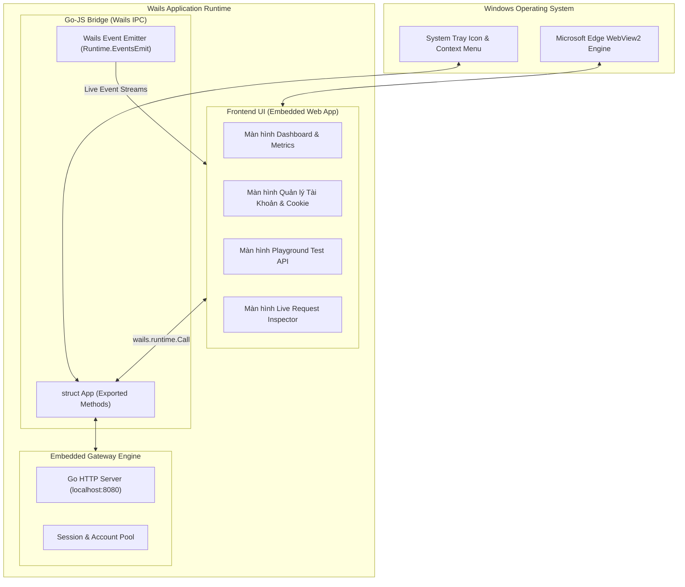

# Module 07: Giao Diện Desktop & Tích Hợp Wails v2 (Wails Desktop GUI)

> Tài liệu đặc tả kiến trúc tích hợp khung ứng dụng Wails v2, liên kết hai chiều giữa Golang và Frontend (Go Bindings), quản lý khay hệ thống (System Tray) và các màn hình chức năng trên Desktop.

---

## 1. Kiến Trúc Wails v2 Trong Dezuxk Gateway

Wails v2 kết hợp sức mạnh hiệu năng cao của Go ở tầng backend và giao diện web hiện đại (HTML/CSS/JS) chạy trên Webview2 gốc của Windows:



---

## 2. Cấu Hình Wails Dự Án (`wails.json`)

```json
{
  "$schema": "https://wails.io/schemas/config.v2.json",
  "name": "dezuxk-gateway",
  "outputfilename": "dezuxk-gateway",
  "frontend:install": "npm install",
  "frontend:build": "npm run build",
  "frontend:dev:watcher": "npm run dev",
  "frontend:dev:serverUrl": "auto",
  "author": {
    "name": "Dezuxk AI",
    "email": "dev@dezuxk.local"
  },
  "info": {
    "companyName": "Dezuxk",
    "productName": "Dezuxk AI Server Gateway",
    "productVersion": "2.0.0",
    "copyright": "Copyright 2026 Dezuxk"
  }
}
```

---

## 3. Các Hàm Go Export Cho Giao Diện Desktop Gọi (`internal/app/bindings.go`)

Toàn bộ các method thuộc struct `App` đều tự động sinh ra file TypeScript/JavaScript tương ứng tại `frontend/wailsjs/go/main/App.js`:

```go
package app

import (
	"context"
	"time"

	"dezuxk-gateway/internal/session"
)

type ServerStatus struct {
	IsRunning     bool   `json:"is_running"`
	ListenPort    int    `json:"listen_port"`
	BaseURL       string `json:"base_url"`
	ActivePools   int    `json:"active_pools"`
	TotalRequests int64  `json:"total_requests"`
	UptimeSeconds int64  `json:"uptime_seconds"`
}

type AccountDTO struct {
	ID          string `json:"id"`
	Email       string `json:"email"`
	FlowCredits int    `json:"flow_credits"`
	TierName    string `json:"tier_name"`
	IsHealthy   bool   `json:"is_healthy"`
	HasOSID     bool   `json:"has_osid"`
}

type App struct {
	ctx        context.Context
	sessionMgr session.Manager
	startTime  time.Time
}

func NewApp(sm session.Manager) *App {
	return &App{
		sessionMgr: sm,
		startTime:  time.Now(),
	}
}

// GetServerStatus trả về trạng thái hoạt động của Gateway Server
func (a *App) GetServerStatus() ServerStatus {
	return ServerStatus{
		IsRunning:     true,
		ListenPort:    8080,
		BaseURL:       "http://localhost:8080/v1",
		ActivePools:   a.sessionMgr.GetActiveAccountsCount(),
		UptimeSeconds: int64(time.Since(a.startTime).Seconds()),
	}
}

// GetAccounts trả về danh sách các tài khoản đang nạp trong Pool
func (a *App) GetAccounts() []AccountDTO {
	return a.sessionMgr.ListAccounts()
}

// AddAccount nạp cookie thủ công hoặc từ file và kiểm tra kết nối ngay
func (a *App) AddAccount(email string, cookieString string, userAgent string) (bool, string) {
	err := a.sessionMgr.AddAccount(email, cookieString, userAgent)
	if err != nil {
		return false, err.Error()
	}
	return true, "Thêm tài khoản và bắt tay thành công"
}

// TestAccountConnection kiểm tra tình trạng sống của tài khoản
func (a *App) TestAccountConnection(accountID string) (bool, string) {
	return a.sessionMgr.TestConnection(accountID)
}

// TriggerLocalChromeSync kích hoạt đọc cookie trực tiếp từ Chrome đang mở qua CDP 9222
func (a *App) TriggerLocalChromeSync() (bool, string) {
	return a.sessionMgr.SyncFromLocalChrome()
}
```

---

## 4. Đặc Tả Các Màn Hình Giao Diện Desktop

### 4.1. Màn Hình 1: Dashboard & Live Inspector
* **Thanh trạng thái Server:** Nút bật/tắt Gateway, địa chỉ Base URL (`http://localhost:8080/v1`), nút 1-click sao chép URL và API Key.
* **Bảng giám sát lưu lượng:** Biểu đồ hiển thị số lượng request hoàn tất, tỷ lệ HTTP 200/400/429, thời gian phản hồi (Latency trung bình ms).
* **Live Request Feed:** Bảng hiển thị từng request đang đi qua Gateway theo thời gian thực (Method, Model, Client IP, Trạng thái stream).

### 4.2. Màn Hình 2: Quản Lý Hồ Tài Khoản (Account Pool Manager)
* **Thẻ hiển thị tài khoản:** Mỗi tài khoản Google hiển thị email, huy hiệu Tier (Free / Google AI Pro), số dư Credit Flow hiện tại (ví dụ: `592 credits`).
* **Hộp thoại Thêm Tài Khoản (Import Modal):**
  * Hỗ trợ dán chuỗi Cookie trực tiếp.
  * Nút "Đồng Bộ Tự Động Từ Chrome" (sử dụng logic CDP cổng 9222 như chúng ta vừa thực hiện).
  * Kiểm tra hợp lệ tức thì: Đánh dấu xanh nếu có đủ `OSID` (cho Flow) và `__Secure-1PSID` (cho Gemini).

### 4.3. Màn Hình 3: Studio & Playground Thử Nghiệm
* **Tab Chat Playground:** Cửa sổ trò chuyện trực tiếp để kiểm tra tốc độ streaming của các model `gemini-3.8-flash`, `gemini-3.1-pro`, toggle Thinking mode.
* **Tab Veo Video Studio:** Khung nhập prompt video, chọn tỉ lệ khung hình (16:9, 9:16), thời lượng (4s-10s), xem trước video ngay trên ứng dụng sau khi render hoàn tất.
* **Tab Voice Personas:** Trình nghe thử 30 giọng đọc mẫu của Google Flow trước khi đưa vào kịch bản sản xuất.

### 4.4. Màn Hình 4: Cài Đặt Hệ Thống (Settings)
* Đổi cổng lắng nghe (Mặc định `8080`).
* Đặt mật khẩu xác thực API Key (`Authorization: Bearer <KEY>`).
* Thư mục lưu trữ media cục bộ và dung lượng tối đa cho phép.

---

## 5. Tích Hợp Khay Hệ Thống (Windows System Tray)

Gateway hỗ trợ chạy ẩn dưới khay đồng hồ Windows để phục vụ các ứng dụng khác mà không chiếm không gian màn hình:

1. **Sự kiện Đóng Ứng Dụng (Window Close):** Khi người dùng bấm nút [X], ứng dụng không tắt hẳn mà thu nhỏ về System Tray.
2. **Menu Chuột Phải Khay Hệ Thống (Tray Context Menu):**
   * **Mở Bảng Điều Khiển:** Kích hoạt hiển thị cửa sổ chính.
   * **Trạng thái:** `● Gateway Đang Chạy (Port 8080)`.
   * **Sao chép OpenAI Base URL:** Sao chép nhanh `http://localhost:8080/v1` vào Clipboard.
   * **Khởi Động Cùng Windows:** Bật/tắt cờ Registry tự chạy ngầm khi mở máy.
   * **Thoát Hoàn Toàn:** Dừng Gateway và thoát ứng dụng.
