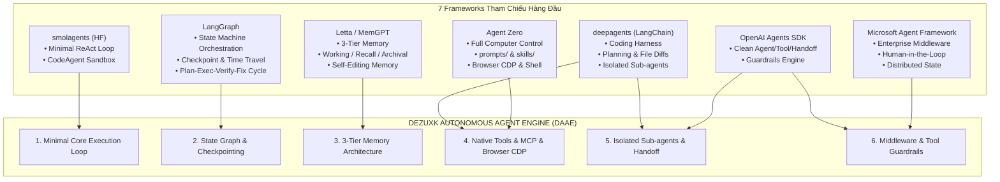
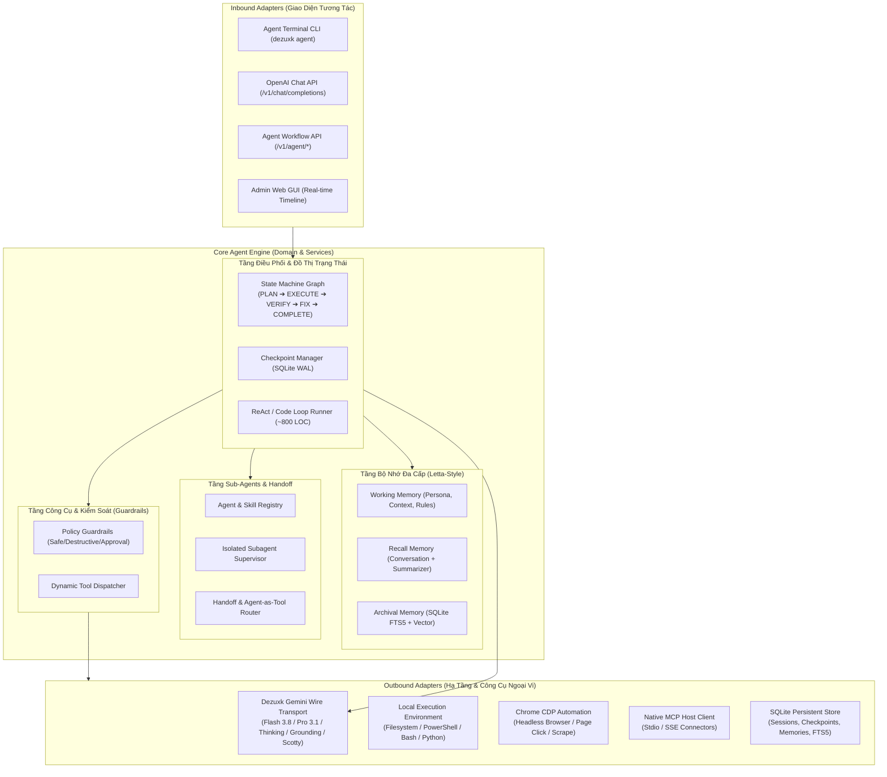
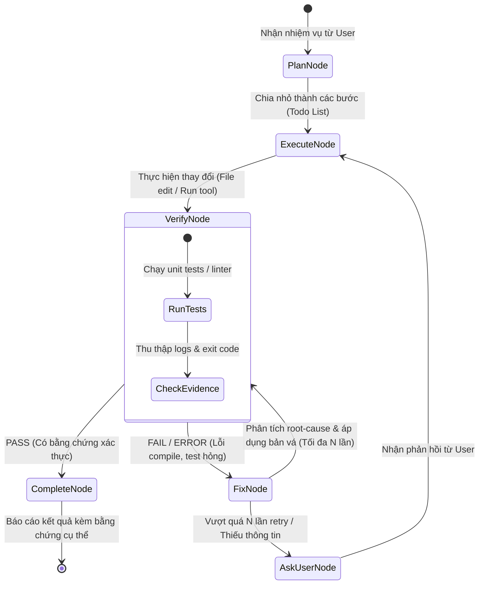
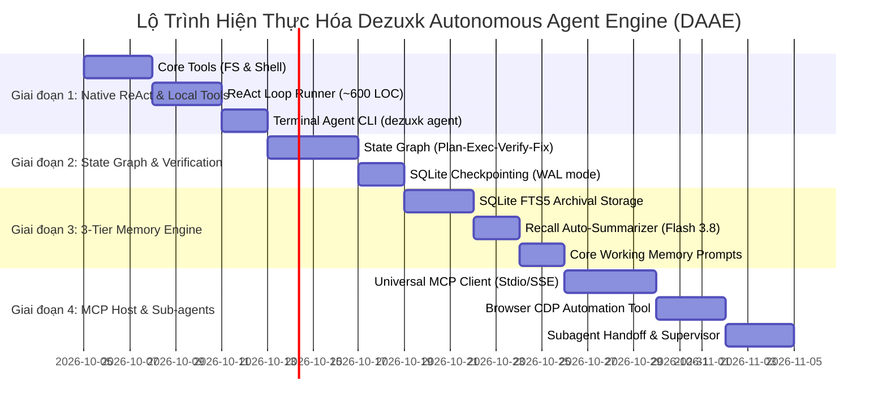

# BẢN THIẾT KẾ TOÀN DIỆN: NÂNG CẤP DEZUXK THÀNH HỆ THỐNG AGENT CHUẨN CHỈ NHẤT
### *(Dezuxk Autonomous Agent Engine - DAAE Architecture Blueprint)*

> **Đúc kết từ 7 Frameworks & Kiến trúc Agent hàng đầu:**
> HuggingFace `smolagents` • LangChain `deepagents` • `Agent Zero` • `Letta / Letta Code` • `LangGraph` • `OpenAI Agents SDK` • `Microsoft Agent Framework`

---

## 1. Hiện Trạng Của Dezuxk: Điểm Mạnh Vượt Trội & Khoảng Trống Cốt Lõi

### 1.1. Những gì Dezuxk đã làm cực kỳ xuất sắc (Unfair Advantages)
Hiện tại, **Dezuxk** là một **AI Gateway hiệu năng cao viết bằng Golang** theo chuẩn **Hexagonal Clean Architecture**:
1. **Hạ tầng LLM miễn phí, tốc độ cao & dung lượng lớn**: Khai thác trực tiếp luồng Web RPC của Google Gemini (`nzlxg`, `wrb.fr` stream), mang lại khả năng truy cập không giới hạn vào `gemini-3.8-flash` (siêu nhanh) và `gemini-3.1-pro` (suy luận sâu).
2. **Các tính năng Native độc quyền của Google**:
   - **Extended Thinking (Chain-of-Thought)**: Trích xuất trực tiếp khối suy nghĩ ẩn của Gemini vào `reasoning_content`.
   - **Search Grounding**: Tìm kiếm Google theo thời gian thực kèm trích dẫn nguồn (`sources`, `favicon`, `domain`).
   - **Python Code Interpreter Sandbox**: Chạy mã Python ngầm trong sandbox cloud của Google.
   - **Multimodal Vision**: Tải tài liệu/ảnh dung lượng lớn qua giao thức Google SCOTTY.
3. **Cơ chế chịu tải và bảo mật**:
   - Quản lý đa tài khoản Google, tự động failover và làm mát (cooldown) khi chạm 429.
   - Kho bảo mật mã hóa **AES-256-GCM Vault** lưu trữ phiên và khóa trên SQLite (WAL mode).
   - Tích hợp sẵn **Chrome DevTools Protocol (CDP)** để trích xuất Cookie từ Chrome thật của người dùng.
4. **Cầu nối Tool Calling**: Đã có `ToolCompiler` (biên dịch JSON Schema thành XML `<tools>`) và `ToolParser` (bóc tách `<tool_call>` từ stream).

### 1.2. Khoảng trống ngăn cản Dezuxk trở thành một "Agent Chuẩn Chỉ"
Mặc dù rất mạnh về mặt Gateway, Dezuxk hiện tại chỉ là **"Động cơ thụ động" (Passive Inference Engine)**:
* **Chưa có Vòng lặp Tự trị (Autonomous ReAct Loop)**: Dezuxk nhận 1 request từ client ngoài (Cursor, chat script), gọi Gemini rồi trả kết quả về. Dezuxk không tự mình quyết định gọi tool, lấy output, rồi tự tiếp tục bước tiếp theo.
* **Chưa có Cơ chế Lập kế hoạch & Kiểm chứng (Plan - Execute - Verify - Fix)**: Khi giao nhiệm vụ phức tạp, mô hình dễ làm ẩu hoặc hallucinate vì không có trạng thái kiểm tra tính đúng đắn (Verify) trước khi đánh dấu hoàn thành.
* **Chưa có Kiến trúc Bộ nhớ Đa tầng (Memory Subsystem)**: Toàn bộ ngữ cảnh hiện tại dựa vào mảng `messages` do client gửi lên. Nếu context dài, hệ thống sẽ tràn token hoặc mất trí nhớ dài hạn về dự án.
* **Chưa có Runtime Tools & MCP Client nội tại**: Dezuxk chưa tự mình đọc/ghi file, chưa tự chạy terminal command, chưa có MCP Host để kết nối các công cụ chuẩn bên ngoài.
* **Chưa có Cấu trúc Prompts / Skills nạp động**: Các chỉ dẫn hệ thống vẫn đang ghép cứng trong mã Go thay vì được module hóa thành các file Markdown/YAML linh hoạt.
* **Chưa có Sub-agent Isolation**: Không thể phân công việc cho các agent con chạy song song (nghiên cứu tài liệu, kiểm thử, viết code) mà không làm ô nhiễm context chính.

---

## 2. Giải Mã Tinh Hoa 7 Frameworks & Ứng Dụng Vào Dezuxk



### Chi tiết phân tích từng Framework:

| Framework | Điểm cốt lõi đáng học | Ứng dụng cụ thể để nâng cấp Dezuxk |
| :--- | :--- | :--- |
| **1. HuggingFace `smolagents`** *(Đánh giá 10/10 lõi agent)* | • Giữ logic vòng lặp dưới 1.000 dòng code.<br>• Vòng lặp tường minh: `Model -> Action -> Observation -> Loop`.<br>• Khái niệm **CodeAgent**: Thay vì gọi 10 tool JSON lẻ tẻ, cho mô hình viết 1 đoạn Python giải quyết logic phức tạp trong 1 lượt. | Xây dựng package `internal/core/services/agent/runner.go` tinh gọn, không rườm rà. Hỗ trợ **Dual Execution**: vừa chạy Tool JSON, vừa tận dụng **Google Code Interpreter có sẵn** của Dezuxk để làm CodeAgent siêu mạnh. |
| **2. LangChain `deepagents`** *(Đánh giá 10/10 coding harness)* | • Kiến trúc chuẩn cho Coding Agent (tương tự Claude Code, Cursor Composer).<br>• Tích hợp `Planner` (quản lý Todo List động).<br>• Thao tác filesystem an toàn với chunking & unified diffs.<br>• Cô lập sub-agents để ngữ cảnh không bị phình to. | Xây dựng công cụ lập trình chuẩn cho Dezuxk: Bộ công cụ đọc/sửa file theo Diff/Patch (`view_file`, `replace_file_content`), Todo tracker hiển thị tiến độ và cơ chế sub-agent chuyên trách. |
| **3. Agent Zero** *(Mô hình Full Computer Agent)* | • Tổ chức mã nguồn hoàn hảo: `prompts/` (chỉ dẫn dạng module), `skills/` (kỹ năng nạp động), `tools/`, `memory/`, `subagents/`.<br>• Tích hợp trực tiếp Browser Automation và Shell Terminal.<br>• Host-bridge an toàn. | Chuẩn hóa cấu trúc thư mục của Dezuxk: Tạo thư mục `prompts/` và `skills/`. Tận dụng module **Chrome CDP** (vốn chỉ dùng lấy cookie) để biến thành **Browser Automation Tool** cho Agent lướt web và thao tác UI! |
| **4. Letta / Letta Code** *(Bậc thầy về Memory)* | • Phân tầng bộ nhớ: **Working/Core Memory** (nhân cách, hồ sơ dự án, scratchpad luôn ở prompt), **Recall Memory** (lịch sử hội thoại), **Archival Memory** (lưu trữ vô hạn, tra cứu ngữ nghĩa).<br>• Agent tự chỉnh sửa bộ nhớ qua tools (`memory_store`, `memory_recall`). | Mở rộng SQLite (WAL mode sẵn có trong `storage/gateway.db`) thêm bảng **Vector / FTS5 (Full-Text Search)**. Dezuxk Agent tự ghi nhớ quyết định kiến trúc, quy ước coding mà không bị tràn context. |
| **5. LangGraph** *(Orchestration & State Machine)* | • Kiểm soát chu trình Agent bằng đồ thị trạng thái hữu hạn (State Graph).<br>• Checkpoint từng bước vào DB (hỗ trợ rollback, time-travel, long-running tasks).<br>• Quy trình bất biến: `PLAN -> EXECUTE -> VERIFY -> FIX -> COMPLETE`. | Xây dựng State Graph nội tại trong Go. Đảm bảo Dezuxk Agent **không bao giờ trả lời bừa là đã xong** nếu bước `VERIFY` chưa chạy pass test/lint. Hỗ trợ tạm dừng và tiếp tục tác vụ chạy dài ngày. |
| **6. OpenAI Agents SDK** *(Core trừu tượng sạch sẽ)* | • Các primitive tối giản: `Agent`, `Tool`, `Handoff`, `Agent-as-Tool`.<br>• Handoff mượt mà giữa các Agent chuyên môn hóa.<br>• Guardrails thẩm định input/output trước và sau khi gọi model/tool. | Xây dựng Interface trong Go chuẩn mực: Mỗi Sub-agent có thể được triệu hồi như một Tool (`invoke_subagent`), hoặc bàn giao toàn bộ quyền kiểm soát (`handoff_to_agent`). |
| **7. Microsoft Agent Framework** *(Production & Enterprise)* | • Middleware Pipeline (Logging, Telemetry, Security Audit, Rate Limiting).<br>• Human-in-the-loop (HIL): Hỏi ý kiến người dùng trước khi thực hiện các lệnh phá hủy (`rm`, format đĩa, drop db). | Xây dựng Pipeline Middleware: Mọi lệnh Shell hoặc thao tác ghi đè file nhạy cảm đều đi qua Security Policy. Hỗ trợ cơ chế interactive modal / prompt xác nhận từ user. |

---

## 3. Kiến Trúc Tổng Thể: Dezuxk Autonomous Agent Engine (DAAE)

Dựa trên nền tảng **Clean / Hexagonal Architecture** đã có trong `internal/`, mô hình Agent Engine sẽ được tích hợp tự nhiên như một UseCase cấp cao mà không làm phá vỡ tính năng Gateway hiện tại.



---

## 4. Năm Trụ Cột Kỹ Thuật Đột Phá

### Trụ Cột 1: Vòng Lặp ReAct Tinh Gọn & Dual Execution Mode (Học smolagents)
Thay vì một framework cồng kềnh với hàng chục lớp trừu tượng lồng nhau, Dezuxk Agent Engine xây dựng vòng lặp thực thi trực tiếp, trong suốt và có thể debug dễ dàng:
1. **Tool-Calling ReAct Loop**:
   - `Gemini Model` phân tích trạng thái $\rightarrow$ Xuất `<tool_call>` kèm arguments.
   - `Dezuxk Engine` chặn stream, phân giải tool name và tham số, thực thi hàm nội bộ hoặc gọi MCP.
   - Đóng gói kết quả thành `[Tool Result (call_id: ...)]: ...` và tiếp tục vòng lặp cho đến khi mô hình xuất câu trả lời kết luận hoặc đạt `max_steps` (mặc định 25).
2. **Native CodeAgent Mode**:
   - Đối với các tác vụ đòi hỏi logic tính toán phức tạp, xử lý dữ liệu lớn hoặc lọc chuỗi nhiều bước, việc gọi từng tool lẻ tẻ qua API sẽ tốn nhiều roundtrip và dễ vỡ.
   - Dezuxk kích hoạt cờ `code_interpreter: true` đã có sẵn của Google Gemini, cho phép Gemini viết nguyên một script Python và chạy trực tiếp trong Sandbox của Google, trả về kết quả cuối cùng trong một lượt duy nhất!

### Trụ Cột 2: Đồ Thị Trạng Thái & Tự Động Sửa Sai (Học LangGraph)
Một lỗi nghiêm trọng khiến các agent hiện nay bị coi là "ngoo" là bệnh **"Tự mãn"**: mô hình sửa xong một đoạn code rồi lập tức báo hoàn thành cho người dùng mà không hề kiểm tra xem code có compile được không, test có pass không.

Dezuxk giải quyết triệt để vấn đề này bằng **State Graph**:



* **Nguyên tắc "No Evidence, No Completion"**: Agent không được phép chuyển sang trạng thái `Complete` trừ khi có kết quả `PASS` từ bài kiểm tra thực tế (exit code 0, kết quả kiểm thử xanh).
* **Checkpointing**: Mỗi khi chuyển node trong đồ thị, trạng thái toàn bộ ngữ cảnh được lưu thành một bản ghi Snapshot vào SQLite. Nếu máy bị sập nguồn hoặc user hủy giữa chừng, agent có thể tiếp tục ngay tại node gần nhất mà không cần chạy lại từ đầu.

### Trụ Cột 3: Hệ Thống Bộ Nhớ 3 Tầng Siêu Việt (Học Letta / Letta Code)
Không nhồi nhét bừa bãi hàng trăm nghìn token vào context, Dezuxk áp dụng mô hình 3 tầng:

1. **Working / Core Memory (Luôn nạp trong System Prompt)**:
   - *Persona Block*: Định danh và vai trò của agent.
   - *User Profile Block*: Sở thích, quy ước coding của người dùng.
   - *Project Rules Block*: Các quy tắc bắt buộc của dự án (ví dụ: Hexagonal architecture, Zero hardcode).
   - *Current Scratchpad*: Bảng nháp ghi chú tạm thời của tác vụ hiện tại.
2. **Recall Memory (Lịch sử hội thoại có nén)**:
   - Lưu trữ các lượt trao đổi gần nhất (Sliding window $K$ turns).
   - Khi vượt ngưỡng dung lượng, kích hoạt **Background Summarizer** chạy ngầm bằng `gemini-3.8-flash` để cô đọng các lượt cũ thành bản tóm tắt súc tích, giữ lại các quyết định kỹ thuật quan trọng.
3. **Archival Memory (Bộ nhớ dài hạn vô hạn)**:
   - Sử dụng **SQLite FTS5 + Vector Embeddings** lưu trữ toàn bộ tài liệu kiến trúc, lịch sử commit, lỗi đã từng gặp và bài học kinh nghiệm.
   - Trang bị 2 công cụ tự trị cho Agent:
     - `memory_store(key, content, tags)`: Agent chủ động lưu một kiến thức/kinh nghiệm mới vào kho.
     - `memory_search(query, top_k)`: Agent chủ động tra cứu kinh nghiệm cũ khi gặp vấn đề tương tự.

### Trụ Cột 4: Hệ Sinh Thái Công Cụ Toàn Diện & Native MCP Host (Học Agent Zero)
Tận dụng tối đa tài nguyên có sẵn trong hệ thống:
1. **Core Local Tools (Bộ công cụ cục bộ)**:
   - `fs_view_file`: Đọc nội dung file kèm đánh số dòng chính xác.
   - `fs_replace_file_content`: Sửa code theo khối thay thế chính xác (tránh việc model viết lại cả file gây tốn token và lỗi thụt lề).
   - `fs_write_file`: Tạo file mới an toàn.
   - `shell_run_command`: Thực thi lệnh trên PowerShell (Windows) hoặc Bash (Linux/macOS) với cơ chế timeout, output streaming và bắt exit status.
2. **Browser Automation Tool (Tận dụng Chrome CDP Profile sẵn có)**:
   - Dezuxk đã có sẵn module Chrome CDP kết nối tới trình duyệt của người dùng (dùng để trích xuất cookie).
   - Nâng cấp module này thành một bộ công cụ điều khiển trình duyệt: `browser_navigate`, `browser_click`, `browser_type`, `browser_screenshot`. Agent có thể tự động mở web, điền form, kiểm thử giao diện web hoặc crawl dữ liệu!
3. **Native MCP Host (Model Context Protocol)**:
   - Dezuxk đóng vai trò là một **MCP Client Host**, cho phép người dùng cắm bất kỳ máy chủ MCP nào vào file `configs/config.yaml` (ví dụ: MCP GitHub, MCP PostgreSQL, MCP Docker, MCP Chrome-DevTools).
   - Hệ thống tự động phát hiện danh sách tools từ các máy chủ MCP và nạp vào danh mục công cụ của Agent.
4. **Tool Guardrails & Human-in-the-Loop (Học Microsoft & OpenAI)**:
   - Phân loại công cụ: **Read-Only** (an toàn, cho phép chạy tự động) vs **Destructive/Mutating** (chạy lệnh shell nguy hiểm, sửa file cấu hình hệ thống).
   - Khi gặp thao tác rủi ro cao, Agent tạm dừng, kích hoạt cờ chờ duyệt và gửi thông báo tới User để xác nhận trước khi tiếp tục.

### Trụ Cột 5: Sub-Agents Độc Lập & Cơ Chế Handoff (Học OpenAI Agents SDK & Deep Agents)
Để giải quyết bài toán lớn mà không làm bùng nổ context window:
1. **Phân tách không gian ngữ cảnh (Context Isolation)**:
   - Agent chính (`Supervisor / Orchestrator`) nhận yêu cầu lớn, phân rã công việc.
   - Tạo ra các **Sub-agent độc lập** với System Prompt chuyên biệt:
     - `Researcher Subagent`: Chỉ có công cụ tra cứu (Google Search Grounding, đọc tài liệu, tìm code bằng ripgrep). Xong việc chỉ trả về bản tóm tắt 5 gạch đầu dòng cho Agent chính.
     - `Coder Subagent`: Tập trung viết mã và chỉnh sửa file.
     - `Reviewer / Verifier Subagent`: Đọc diff thay đổi, chạy test độc lập và đánh giá chất lượng mã nguồn.
2. **Handoff & Agent-as-Tool**:
   - Agent chính có thể gọi Subagent như một Tool (`invoke_subagent(role="researcher", prompt="...")`).
   - Hoặc chuyển giao quyền kiểm soát hoàn toàn (`handoff_to(agent="reviewer")`).

---

## 5. Tổ Chức Mã Nguồn Đề Xuất (Tương thích Clean Architecture)

Để giữ đúng tinh thần **Clean / Hexagonal Architecture** của Dezuxk, cấu trúc thư mục sẽ được bổ sung một cách tự nhiên như sau:

```
dezuxk/
├── cmd/
│   ├── daemon/                    # Entrypoint Server Gateway cũ (giữ nguyên 100%)
│   │   └── main.go
│   └── agent/                     # Entrypoint mới: Interactive Terminal Agent CLI
│       └── main.go                # Chạy: dezuxk agent "sửa lỗi memory leak..."
├── internal/
│   ├── core/
│   │   ├── domain/
│   │   │   ├── ... (các domain cũ: account, chat, model, rpc...)
│   │   │   └── agent/             # [MỚI] Thực thể nghiệp vụ Agent
│   │   │       ├── state.go       # Agent State, Step, Execution Context
│   │   │       ├── plan.go        # TodoList, StepItem, StepStatus
│   │   │       ├── memory.go      # Working, Recall, Archival Memory entities
│   │   │       ├── tool.go        # ToolDefinition, ToolResult, PermissionLevel
│   │   │       └── subagent.go    # SubagentDescriptor, HandoffContext
│   │   ├── ports/
│   │   │   ├── ... (các port cũ)
│   │   │   └── agent_ports.go     # [MỚI] Interfaces: AgentRunner, StateGraph, MemoryStore, McpHost
│   │   └── services/
│   │       ├── ... (các service cũ: chat_service, tool_parser...)
│   │       └── agent/             # [MỚI] Triển khai logic Agent Engine
│   │           ├── runner.go      # Minimalist ReAct Loop (~600 LOC)
│   │           ├── graph.go       # State Machine (Plan-Exec-Verify-Fix)
│   │           ├── memory_svc.go  # 3-Tier Memory Manager + Summarizer
│   │           ├── subagent_svc.go# Subagent Supervisor & Context Isolator
│   │           └── guardrail.go   # Tool Execution Guardrails & Policy Engine
│   ├── adapters/
│   │   ├── inbound/
│   │   │   ├── http/              # Thêm route /v1/agent/run, /v1/agent/threads
│   │   │   └── cli/               # Terminal Interactive UI (tương tự deepagents-code/claude-code)
│   │   │       └── terminal.go
│   │   └── outbound/
│   │       ├── tools/             # [MỚI] Các bộ công cụ thực thi nội tại
│   │       │   ├── filesystem.go  # view, replace, write, diff
│   │       │   ├── terminal.go    # PowerShell / Bash execution engine
│   │       │   ├── browser_cdp.go # Điều khiển Chrome qua CDP có sẵn
│   │       │   └── memory_fts.go  # SQLite FTS5 / Vector memory adapter
│   │       └── mcp/               # [MỚI] Universal MCP Client (Stdio / SSE)
│   │           └── client.go
├── prompts/                       # [MỚI] Hệ thống Prompt Templates dạng Markdown
│   ├── system_agent.md            # System prompt cốt lõi
│   ├── planner.md                 # Hướng dẫn lập kế hoạch
│   ├── verifier.md                # Hướng dẫn kiểm chứng kết quả
│   └── code_repair.md             # Hướng dẫn tìm nguyên nhân gốc rễ và sửa lỗi
├── skills/                        # [MỚI] Kỹ năng chuyên sâu được nạp động
│   ├── go_clean_arch/             # Kỹ năng viết Go chuẩn Clean Architecture
│   │   └── SKILL.md
│   ├── git_workflow/              # Kỹ năng commit, branch, stash
│   │   └── SKILL.md
│   └── web_testing/               # Kỹ năng test web qua Chrome CDP
│       └── SKILL.md
└── configs/
    ├── config.yaml                # Mở rộng thêm cấu hình agent, memory, mcp_servers
    └── models.yaml
```

---

## 6. Lộ Trình Triển Khai Chi Tiết Theo 4 Giai Đoạn (Phased Roadmap)



### Chi tiết các pha:
* **Giai đoạn 1: Lõi Tự Trị & Bộ Công Cụ Cục Bộ (Tập trung tinh thần `smolagents`)**
  - Xây dựng bộ công cụ: đọc file, sửa file theo diff, chạy lệnh PowerShell/Bash an toàn.
  - Viết vòng lặp ReAct trong `internal/core/services/agent/runner.go`.
  - Tạo lệnh CLI `dezuxk agent "mô tả việc cần làm"` để người dùng có thể chạy trực tiếp từ terminal.
* **Giai đoạn 2: Đồ Thị Trạng Thái & Tự Động Sửa Lỗi (Tập trung tinh thần `LangGraph`)**
  - Hiện thực hóa State Graph: Bắt buộc mọi tác vụ phải có bước `Verify`. Nếu verify fail, tự động kích hoạt `Fix` với log lỗi từ terminal.
  - Lưu checkpoint từng bước vào SQLite để có thể khôi phục tiến trình khi bị ngắt quãng.
* **Giai đoạn 3: Hệ Thống Bộ Nhớ Đa Tầng (Tập trung tinh thần `Letta`)**
  - Bổ sung bảng FTS5 vào `storage/gateway.db` phục vụ Archival Memory.
  - Tạo công cụ `memory_store` và `memory_search`.
  - Tích hợp tính năng tự động tóm tắt ngữ cảnh hội thoại cũ bằng `gemini-3.8-flash`.
* **Giai đoạn 4: Hệ Sinh Thái MCP, Trình Duyệt & Sub-agents (Tập trung tinh thần `Agent Zero` & `OpenAI Agents SDK`)**
  - Viết Client kết nối MCP servers qua Stdio.
  - Tận dụng kết nối Chrome CDP sẵn có để tạo `browser_tools` cho agent duyệt web và tương tác UI.
  - Triển khai `invoke_subagent` để phân quyền cho các agent con làm việc song song trong các workspace/context độc lập.

---

## 7. Giá Trị Khác Biệt Khi Hoàn Thành (Unfair Competitive Advantages)

Khi hoàn thiện theo bản thiết kế này, **Dezuxk Agent** sẽ sở hữu những lợi thế cạnh tranh mà hầu như không một framework agent nào trên thị trường có được:
1. **Siêu nhẹ & Siêu nhanh (Golang Native)**:
   - Biên dịch thành **1 file binary duy nhất**, khởi động trong **dưới 10ms**, chiếm RAM **chỉ từ 30MB - 50MB**.
   - Khác biệt hoàn toàn so với các framework Python cồng kềnh (thường tốn hàng trăm MB RAM, khởi động chậm và gặp ác mộng về quản lý môi trường ảo/pip).
2. **Hạ tầng AI Đỉnh cao Hoàn toàn Miễn phí**:
   - Sử dụng **Gemini 3.8 Flash** cho các tác vụ routing, tóm tắt memory, kiểm tra cú pháp (tốc độ ánh sáng).
   - Sử dụng **Gemini 3.1 Pro + Extended Thinking** cho các bài toán kiến trúc, suy luận thuật toán phức tạp.
   - Tận dụng **Google Search Grounding** và **Google Cloud Code Interpreter** mà không tốn thêm 1 xu chi phí API!
3. **Cơ chế Tự Trị Thực Sự (Self-Healing & Evidence-Based)**:
   - Không còn tình trạng agent "chém gió" là đã sửa xong nhưng thực tế chạy lỗi. Mọi quyết định đều dựa trên bằng chứng kiểm thử tươi mới từ terminal.
4. **Tương thích Kép**:
   - Vừa là **AI Gateway** phục vụ các công cụ bên ngoài (Cursor, NextChat, OpenWebUI).
   - Vừa là **Autonomous Coding Agent độc lập** hoạt động trực tiếp trên máy người dùng.
