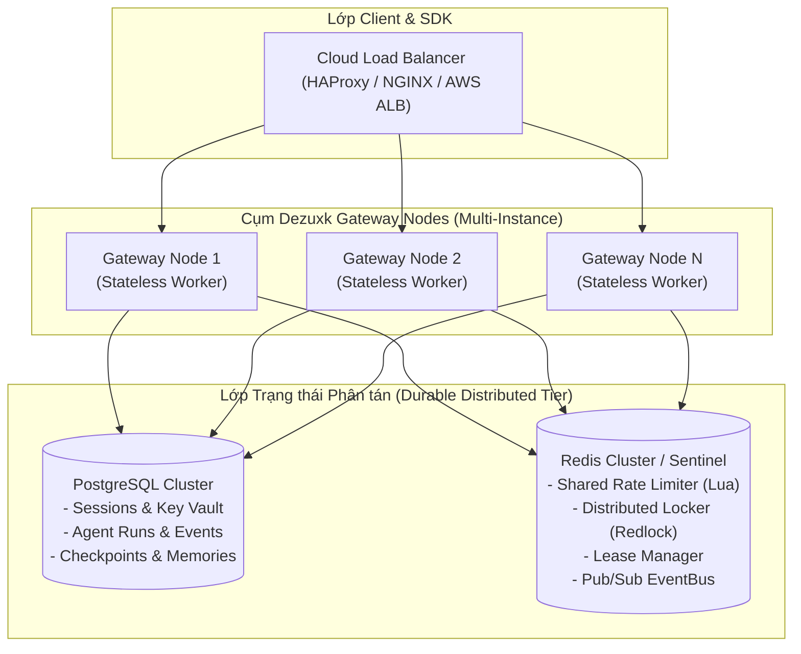

# Kiến trúc Đa Node & Cụm Phân tán (Multi-Node Architecture)

Tài liệu này xác định mô hình kiến trúc phân tán (Multi-Node Gateway Cluster) cho Dezuxk AI Gateway, lộ trình chuẩn hóa interface (Hexagonal Ports), mô hình nhất quán dữ liệu (Consistency & Fencing Model), và cơ chế phòng vệ chống split-brain.

---

## 1. Hiện trạng Hệ thống (Current Status)

| Thành phần (Component) | Trạng thái hiện tại | Công nghệ vận hành | Ghi chú độ tin cậy |
| :--- | :--- | :--- | :--- |
| **Node Mode** | **Single-Node READY** | Headless Daemon | Độc lập, không phụ thuộc cụm ngoài |
| **Persistence Storage** | **Production Ready** | SQLite WAL (fsync/atomic) | Bền vững trên đĩa, AES-256 Vault |
| **Rate Limiter** | **Single-Node Ready** | Token Bucket + In-Flight Mutex | Giới hạn IP, Tenant, Key, Model |
| **Agent Fencing** | **Single-Node Ready** | Lease generation + Memory/DB | Fencing tokens đã được chuẩn hóa |
| **Distributed Redis/Postgres**| **PARTIAL / FAIL-FAST** | Interfaces & Config ready | Cấm fake readiness; startup fail-fast |

> [!IMPORTANT]
> **Nguyên tắc Truthful Readiness**:
> Hệ thống tuyệt đối không dùng local in-memory map để giả lập môi trường phân tán. Khi cấu hình `storage.driver=postgres` hoặc `distributed.enabled=true`, daemon kiểm tra sự sẵn sàng thực tế và **báo lỗi dừng khởi động ngay lập tức (fail-fast)** vì các adapter kết nối driver Redis/Postgres chưa được kết nối trọn vẹn trong Phase 2.

---

## 2. Mô hình Kiến trúc Mục tiêu (Target Distributed Architecture)



---

## 3. Chuẩn hóa Hệ thống Cổng (Standardized Ports & Interfaces)

Các giao diện phân tán được chuẩn hóa hoàn toàn tại gói [`internal/core/ports`](file:///d:/nhathao/Vibe/dezuxk-agent/internal/core/ports):

### 3.1. `DistributedLocker` ([distributed.go](file:///d:/nhathao/Vibe/dezuxk-agent/internal/core/ports/distributed.go))
```go
type DistributedLocker interface {
    AcquireLock(ctx context.Context, key string, ttl time.Duration) (release func() error, acquired bool, err error)
}
```
- **Triển khai đơn node**: `sync.Mutex` / in-memory key mutex.
- **Triển khai đa node**: Redis SET with NX + PX hoặc Redlock thuật toán phân tán có TTL tự hủy an toàn.

### 3.2. `SharedRateLimiter` ([ratelimit.go](file:///d:/nhathao/Vibe/dezuxk-agent/internal/core/ports/ratelimit.go))
```go
type SharedRateLimiter interface {
    RateLimiter
}
```
- **Triển khai đơn node**: `LocalRateLimiter` (sliding token bucket per visitor).
- **Triển khai đa node**: Redis Sliding Window Rate Limiter chạy qua Lua Script nguyên tử, chia sẻ hạn mức RPM/TPM trên toàn cụm.

### 3.3. `LeaseManager` & Fencing Tokens ([distributed.go](file:///d:/nhathao/Vibe/dezuxk-agent/internal/core/ports/distributed.go))
```go
type LeaseManager interface {
    AcquireLease(ctx context.Context, resourceID, workerID string, ttl time.Duration) (generation int64, acquired bool, err error)
    RenewLease(ctx context.Context, resourceID, workerID string, generation int64, ttl time.Duration) (renewed bool, err error)
    ReleaseLease(ctx context.Context, resourceID, workerID string, generation int64) error
}
```
- Cung cấp `generation int64` đơn điệu tăng (Monotonically Increasing Fencing Token).

### 3.4. `EventBus` ([distributed.go](file:///d:/nhathao/Vibe/dezuxk-agent/internal/core/ports/distributed.go))
```go
type EventBus interface {
    Publish(ctx context.Context, topic string, payload []byte) error
    Subscribe(ctx context.Context, topic string) (events <-chan []byte, unsubscribe func(), err error)
}
```
- Cho phép truyền phát sự kiện Agent Run Events (thought, tool_call, tool_result, message) theo thời gian thực tới tất cả các node đang giữ kết nối SSE với client.

---

## 4. Mô hình Nhất quán & Phòng vệ Split-Brain (Consistency & Fencing Model)

### 4.1. Vấn đề "Zombie Worker" khi Node bị GC Pause hoặc Network Partition
Nếu Node 1 đang thực thi Agent Run nhưng bị nghẽn mạng (Network Partition), Lease hết hạn và Node 2 nhận quyền thực thi. Khi Node 1 tỉnh lại, nếu Node 1 tiếp tục ghi dữ liệu vào cơ sở dữ liệu thì sẽ gây corrupt dữ liệu.

### 4.2. Giải pháp: Fencing Token (`claim_generation`)
1. Mỗi khi tác vụ được gán cho một worker qua `ClaimRun`, thế hệ sở hữu (`claim_generation`) được tăng thêm 1:
   ```sql
   UPDATE agent_runs 
   SET worker_id = :worker_id, 
       claim_generation = claim_generation + 1, 
       lease_expire_at = :lease_expire_at
   WHERE id = :run_id AND (worker_id IS NULL OR lease_expire_at < :now);
   ```
2. Mọi truy vấn ghi trạng thái hoặc chèn sự kiện (`UpdateOwned`, `AppendOwnedEvent`) bắt buộc phải kiểm tra điều kiện thế hệ:
   ```sql
   UPDATE agent_runs
   SET status = :status, output = :output, updated_at = :now
   WHERE id = :run_id 
     AND worker_id = :worker_id 
     AND claim_generation = :claim_generation;
   ```
3. Nếu Node 1 cố gắng ghi với generation cũ, câu lệnh SQL trả về `rows_affected == 0`, hệ thống phát hiện mất quyền sở hữu và lập tức hủy bỏ luồng thực thi (Fail-fast termination).

---

## 5. Phục hồi Sự cố Tự động (Failure Recovery & Crash Resilience)

1. **Worker Crash Detection**: Mỗi node định kỳ gia hạn lease cho các tác vụ đang chạy (`RenewLease`). Nếu node gặp lỗi phần cứng hoặc sập tiến trình, sau khi TTL hết hạn, các node khác sẽ nhận diện tác vụ mồ côi (`ScanRecoverableRuns`).
2. **Safe Resume**: Node mới phục hồi tác vụ từ bản lưu Snapshot mới nhất trong `CheckpointRepository`.
3. **Idempotent Tool Execution**: `ToolExecutionLedger` ghi nhận trạng thái tool call trước và sau khi gọi để tránh chạy lại các tác vụ có side-effect bên ngoài (ví dụ gửi email, gọi webhook).

---

## 6. Lộ trình Triển khai Adapter Thật (Phase 3 Integration Roadmap)

1. Xây dựng `internal/adapters/outbound/storage/postgres`:
   - Chạy Migration script SQL chuẩn cho PostgreSQL 15+.
   - Cung cấp Connection Pool (`pgxpool.Pool`) với health check và retry backoff.
2. Xây dựng `internal/adapters/outbound/distributed/redis`:
   - Redis Sentinel / Cluster client với tự động failover.
   - Triển khai Lua script cho `SharedRateLimiter`.
   - Triển khai Redis Streams / PubSub cho `EventBus`.
3. Bài kiểm thử tích hợp (Integration Tests) chạy trên Testcontainers Docker độc lập cho Redis và PostgreSQL.
