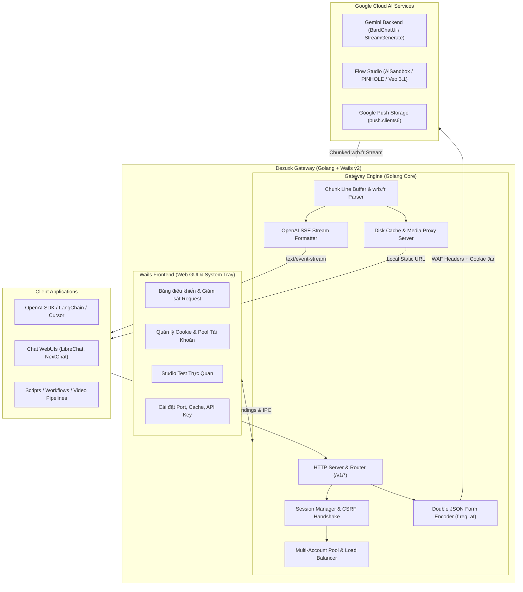

# Bộ Tài Liệu Kỹ Thuật: Hệ Thống AI Gateway (Go + Wails)

> **Dự án:** Dezuxk AI Server Gateway & Desktop Control Center  
> **Nền tảng:** Golang (Backend & Core Engine) + Wails v2 (Desktop GUI & Tray System)  
> **Mục tiêu:** Cung cấp cổng chuyển đổi giao thức (Gateway / Reverse Proxy) từ chuẩn **OpenAI API** (`/v1/chat/completions`, `/v1/images`, `/v1/audio`) và các **Extended Endpoints** chuyên sâu sang mạng lưới Google Gemini & Google Flow Studio đã được xác thực 100% trong `docs-2`.

---

## 1. Tầm Nhìn & Mục Đích Dự Án

Hệ thống Gateway hoạt động như một máy chủ proxy cục bộ (Local Server) kiêm ứng dụng điều khiển Desktop (Wails App):
1. **Chuẩn hóa API (OpenAI Compatible):** Mọi ứng dụng client, công cụ AI, tiện ích mở rộng (NextChat, LibreChat, Cursor, Cline, AutoGen, custom scripts) có thể trỏ trực tiếp `baseUrl: http://localhost:8080/v1` để trò chuyện với Gemini hoặc tạo ảnh với Abra mà không cần thay đổi mã nguồn client.
2. **Khai phóng Toàn Bộ Sức Mạnh Của Google Flow:** Cung cấp các endpoint mở rộng độc quyền cho việc tạo video Veo 3.1 (Quality/Fast/Lite), nâng cấp 4K, điều khiển Camera chuyển động 3D, lồng tiếng với 30 Voice Personas và quản lý đồ thị PINHOLE.
3. **Quản Trị Phiên & Bảo Mật WAF Tự Động:** Tự động giải quyết bài toán CSRF `SNlM0e`, luân chuyển token thời gian `__Secure-1PSIDTS`, bảo toàn cookie `OSID` riêng biệt cho Flow, và duy trì bộ nhận diện Header chuẩn Chrome.
4. **Bảo Tồn Tài Nguyên Truyền Thông:** Tự động tải và cache cục bộ các liên kết CDN ảnh/video tạm thời của Google (Signed URLs hết hạn sau 12-24h), phân phối lại qua endpoint `/v1/media/<asset_id>`.

---

## 2. Sơ Đồ Kiến Trúc Hệ Thống (System Architecture)

---

## 3. Danh Mục Các Module Trong Bộ Tài Liệu `docs-gateway/`

Bộ tài liệu này được chia thành 8 chuyên đề kỹ thuật chi tiết:

| STT | Tệp Tin Đặc Tả | Nội Dung Chi Tiết |
| :---: | :--- | :--- |
| **01** | [01_system_architecture.md](01_system_architecture.md) | **Kiến Trúc Tổng Thể & Thiết Kế Module:** Thiết kế các gói Go (`pkg/`), luồng dữ liệu, phân tầng trách nhiệm. |
| **02** | [02_authentication_and_session_pool.md](02_authentication_and_session_pool.md) | **Quản Lý Phiên, Cookie & Multi-Account Pool:** Nạp cookie, tự động handshake `SNlM0e`, xoay vòng `__Secure-1PSIDTS`, quản lý hạn mức & cân bằng tải. |
| **03** | [03_openai_compatibility_layer.md](03_openai_compatibility_layer.md) | **Chuẩn Hóa API Tương Thích OpenAI:** Đặc tả đầy đủ `/v1/models`, `/v1/chat/completions` (Streaming & Non-Streaming), `/v1/images/generations`, `/v1/audio/speech`. |
| **04** | [04_extended_flow_video_api.md](04_extended_flow_video_api.md) | **Bộ API Mở Rộng Cho Google Flow & Veo Video:** Đặc tả chi tiết tạo video Veo 3.1, mở rộng clip, camera 3D, nâng cấp 4K, 30 giọng đọc và đồ thị PINHOLE. |
| **05** | [05_streaming_and_wire_protocol.md](05_streaming_and_wire_protocol.md) | **Xử Lý Luồng Streaming & Wire Protocol Trong Go:** Thuật toán Buffer ghép dòng, gỡ bỏ `)]}'\n`, unwrap mảng `wrb.fr`, đóng gói SSE chuẩn `data: {...}`. |
| **06** | [06_media_proxy_and_caching.md](06_media_proxy_and_caching.md) | **Lưu Trữ Cục Bộ & Proxy Tải Media:** Cơ chế tải ngầm video/ảnh về đĩa, phục vụ qua endpoint nội bộ `/v1/media/<id>`, chính sách xóa xoay vòng. |
| **07** | [07_wails_desktop_gui.md](07_wails_desktop_gui.md) | **Giao Diện Desktop & Tích Hợp Wails v2:** Cấu trúc Wails Go Binding, giao diện điều khiển, System Tray, bộ điều hướng cấu hình và log thời gian thực. |
| **08** | [08_deployment_and_configuration.md](08_deployment_and_configuration.md) | **Cấu Hình, Biên Dịch & Vận Hành:** Schema `config.yaml`, cơ chế chạy Headless Daemon hoặc Desktop GUI, tối ưu hiệu năng HTTP Transport. |
| **09** | [09_bang_operation.md](09_bang_operation.md) | **Bảng operation đang sống:** Mức trưởng thành từng RPC, hợp đồng `nzlxg`, lớp lỗi, và quyết định session. |

---

## 4. Công Nghệ & Thư Viện Đề Xuất (Go & Wails Tech Stack)

* **Ngôn ngữ lõi:** Golang `>= 1.22` (Tận dụng `net/http` tối ưu, `sync.Pool`, Context cancel).
* **Khung ứng dụng Desktop:** [Wails v2](https://wails.io/) (`github.com/wailsapp/wails/v2`).
* **HTTP Router:** [Chi](https://github.com/go-chi/chi/v5) hoặc Gin (nhẹ, hỗ trợ middleware SSE native tốt).
* **Quản lý cấu hình:** [Viper](https://github.com/spf13/viper) hoặc YAML thuần.
* **Lưu trữ dữ liệu nhỏ:** SQLite (qua `modernc.org/sqlite` thuần Go) hoặc JSON file storage cho danh sách accounts/tokens.
* **Giao diện Desktop (Wails Frontend):** HTML5, Vanilla CSS / TailwindCSS, Vanilla JS hoặc Vue/Svelte gọn nhẹ.
