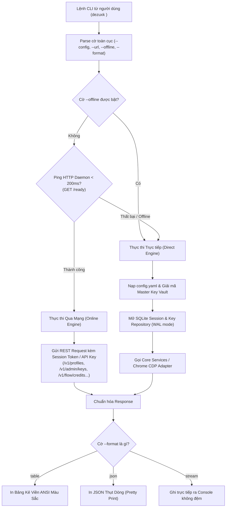

# Tài Liệu Đặc Tả Thiết Kế: Thay Thế Web UI Bằng Hệ Thống Vận Hành Dòng Lệnh CLI (Dezuxk Unified CLI)

- **Dự án**: dezuxk-gateway
- **Trạng thái**: Đã phê duyệt thiết kế (Design Approved)
- **Ngày lập**: 2026-09-26
- **Kiến trúc sư**: Antigravity AI Gateway Lead Engineer

---

## 1. Bối Cảnh & Mục Tiêu (Context & Objectives)

### 1.1. Bối cảnh
Dezuxk AI Gateway ban đầu được tích hợp một giao diện Web UI nhúng (Embedded Admin Dashboard tại `/admin`) phục vụ quản trị tài khoản, profile và metric qua trình duyệt. Tuy nhiên, theo định hướng chuẩn mực của một hạ tầng Gateway backend chuyên dụng:
- Không cần thiết và không mong muốn duy trì client/giao diện web bên trong repository của gateway.
- Cần một công cụ dòng lệnh (Command-Line Interface - CLI) mạnh mẽ, chuyên nghiệp, hỗ trợ đầy đủ 100% tính năng của Gateway để người vận hành kiểm soát hệ thống trực tiếp từ Terminal/SSH.

### 1.2. Mục tiêu chính
1. **Loại bỏ triệt để Web UI & Client**: Xóa hoàn toàn mã nguồn web frontend nhúng (`internal/adapters/inbound/web/`) và gỡ bỏ route `/admin` khỏi router HTTP.
2. **Bảo toàn 100% tính năng & options hiện có**: Mọi chức năng (Profile, Chrome CDP, Virtual Keys, Gemini Chat, Flow Studio, Cache, Cảnh báo, Health) đều tiếp tục hoạt động đầy đủ.
3. **Triển khai Unified CLI (Hybrid Engine)**:
   - Xây dựng binary dòng lệnh đa năng dựa trên chuẩn công nghiệp **Cobra** (`github.com/spf13/cobra`).
   - Hỗ trợ cơ chế lai (Hybrid): Tự động phát hiện nếu Daemon đang chạy để gửi REST API nội bộ (tránh xung đột database/cache), hoặc truy cập trực tiếp SQLite/Vault khi offline.
4. **Trình định dạng đầu ra chuyên nghiệp**: Hỗ trợ xuất bảng màu ANSI (`--format=table`), xuất dữ liệu cấu trúc (`--format=json`), và streaming văn bản trực tiếp khi chat.

---

## 2. Rà Soát Tính Năng & Các Tùy Chọn (Feature & Option Audit)

Hệ thống cung cấp 9 nhóm tính năng cốt lõi được ánh xạ hoàn chỉnh sang CLI:

| STT | Nhóm Tính Năng | Lệnh CLI Tương Ứng | Các Tùy Chọn / Subcommands Chi Tiết |
|---|---|---|---|
| 1 | **Server Daemon** | `dezuxk start` / `run` | `--config <path>`, `--port <port>` |
| 2 | **Trạng Thái Hệ Thống** | `dezuxk status` | `--format table\|json`, kiểm tra Health, RPM, Active Models, Cache, Alerts |
| 3 | **Quản Lý Chrome Profile** | `dezuxk profile` | `list`, `create <id>`, `launch <id> [--cdp-port] [--headless]`, `sync <id>`, `ingest <id> [--file\|--json]`, `proxy <id> --url <url>`, `delete <id>` |
| 4 | **Virtual API Keys** | `dezuxk key` | `list`, `create --name <str> [--rpm <int>] [--admin] [--expires <dur>]`, `revoke <id>` |
| 5 | **Chat AI Trực Tiếp** | `dezuxk chat` | `--prompt <text>`, `--model <id>`, `--stream`, `--image <path>`, `--system <text>`, `--temp <float>` |
| 6 | **Flow Video & Studio** | `dezuxk flow` | `credits [--account <id>]`, `projects [list\|create\|trash\|restore\|delete]`, `voices`, `audio --prompt <text>` |
| 7 | **Gemini Advanced** | `dezuxk gemini` | `usage [--account <id>]`, `conversations [list\|get\|rename\|delete]` |
| 8 | **Response Cache** | `dezuxk cache` | `status` (xem hit/miss/tỷ lệ), `purge` (xóa sạch bộ nhớ đệm RAM) |
| 9 | **Cảnh Báo & Alerts** | `dezuxk alerts` | `list` (danh sách cảnh báo drift/session), `clear [--account <id>]` |

---

## 3. Kiến Trúc Kỹ Thuật (Technical Architecture)

### 3.1. Cấu Trúc Thư Mục Thay Đổi
```text
dezuxk-gateway/
├── main.go                                  # Điểm vào chính: chạy Cobra Root Command
├── internal/
│   ├── adapters/
│   │   ├── inbound/
│   │   │   ├── http/
│   │   │   │   ├── router.go                # [SỬA] Gỡ bỏ route /admin và web package
│   │   │   │   └── ...                      # Các REST handlers khác giữ nguyên
│   │   │   └── cli/                         # [MỚI] Package Adapter CLI
│   │   │       ├── root.go                  # Khởi tạo RootCmd và cờ toàn cục
│   │   │       ├── start.go                 # Lệnh 'dezuxk start'
│   │   │       ├── status.go                # Lệnh 'dezuxk status'
│   │   │       ├── profile.go               # Nhóm lệnh 'dezuxk profile'
│   │   │       ├── key.go                   # Nhóm lệnh 'dezuxk key'
│   │   │       ├── chat.go                  # Lệnh 'dezuxk chat'
│   │   │       ├── flow.go                  # Nhóm lệnh 'dezuxk flow'
│   │   │       ├── gemini.go                # Nhóm lệnh 'dezuxk gemini'
│   │   │       ├── cache.go                 # Nhóm lệnh 'dezuxk cache'
│   │   │       ├── alerts.go                # Nhóm lệnh 'dezuxk alerts'
│   │   │       ├── client.go                # Client HTTP gọi REST API nội bộ khi Online
│   │   │       ├── direct.go                # Khởi tạo Services cục bộ khi Offline
│   │   │       └── printer.go               # Format dữ liệu bảng ANSI và JSON
│   │   └── outbound/                        # Outbound adapters hiện có (giữ nguyên)
│   └── app/daemon/daemon.go                 # Chạy server HTTP daemon
```

### 3.2. Sơ Đồ Khối Điều Phối Lai (Hybrid Execution Engine)



---

## 4. Đặc Tả Chi Tiết Từng Nhóm Lệnh CLI

### 4.1. Cờ Toàn Cục (Global Flags)
- `--config, -c string`: Đường dẫn tệp cấu hình (mặc định: `"configs/config.yaml"`).
- `--format, -f string`: Định dạng xuất dữ liệu (`"table"` hoặc `"json"`, mặc định `"table"`).
- `--url string`: URL cơ sở của Gateway Daemon (mặc định đọc từ `config.yaml`: `http://<host>:<port>`).
- `--offline, -d`: Bỏ qua kiểm tra daemon, ép buộc đọc/ghi trực tiếp SQLite/Vault.
- `--token string`: Ghi đè Admin Token / API Key cho các request online.

### 4.2. Lệnh `dezuxk start` / `dezuxk run`
- **Mục đích**: Khởi động Gateway Server Daemon.
- **Flags**:
  - `--port, -p int`: Ghi đè cổng lắng nghe (mặc định lấy từ cấu hình).
- **Hành vi**: Gọi trực tiếp `daemon.Run(configPath, portOverride)` và xử lý tín hiệu kết thúc OS graceful shutdown.

### 4.3. Lệnh `dezuxk status`
- **Mục đích**: Hiển thị bảng tổng hợp trạng thái hoạt động của Gateway.
- **Nội dung hiển thị**:
  - Trạng thái máy chủ (Online / Offline / Standby).
  - Địa chỉ phục vụ API & Số lượng mô hình đang active.
  - Số lượng tài khoản Google trong pool (Healthy / Expired).
  - Tỷ lệ đệm phản hồi: Tổng lượt, Hits, Misses, Hit Ratio (%).
  - Số cảnh báo hệ thống chưa xử lý.

### 4.4. Lệnh `dezuxk profile`
- `dezuxk profile list`: Bảng danh sách các tài khoản: `ACCOUNT_ID`, `EMAIL`, `TIER`, `HEALTH`, `PROXY`, `FLOW_CREDITS`, `SERVICES`.
- `dezuxk profile create <id>`: Tạo profile mới với ID chỉ định.
- `dezuxk profile launch <id>`: Khởi chạy Chrome thực tế với cổng `--remote-debugging-port`.
  - Flags: `--cdp-port int`, `--headless bool`.
- `dezuxk profile sync <id>`: Kết nối CDP WebSocket, trích xuất cookie và token `SNlM0e`.
- `dezuxk profile ingest <id>`: Nạp cookie thủ công từ JSON file hoặc raw string.
  - Flags: `--file string`, `--json string`.
- `dezuxk profile proxy <id> --url <proxy_url>`: Cấu hình Proxy (HTTP/SOCKS5), tự động mã hóa vào Vault AES-256-GCM.

### 4.5. Lệnh `dezuxk key`
- `dezuxk key list`: Liệt kê các Virtual API Keys (`KEY_ID`, `NAME`, `MASKED_KEY`, `RPM_LIMIT`, `IS_ADMIN`, `CREATED_AT`).
- `dezuxk key create`: Sinh Virtual API Key mới.
  - Flags: `--name string` (bắt buộc), `--rpm int` (mặc định 0), `--admin bool` (mặc định false).
- `dezuxk key revoke <id>`: Thu hồi / vô hiệu hóa key.

### 4.6. Lệnh `dezuxk chat`
- **Mục đích**: Tương tác và thử nghiệm prompt AI trực tiếp trên dòng lệnh.
- **Flags**:
  - `--prompt, -p string`: Nội dung prompt (nếu để trống, hỗ trợ đọc từ stdin).
  - `--model, -m string`: Mô hình Gemini (mặc định: mô hình chat đầu tiên tìm thấy).
  - `--stream bool`: Bật phản hồi trực tiếp (mặc định `true`).
  - `--system string`: Hướng dẫn hệ thống (System instruction).
  - `--image string`: Đường dẫn tệp ảnh cục bộ (tự động phân giải qua Vision Resolver).
  - `--temp float64`: Cấu hình Temperature.

### 4.7. Lệnh `dezuxk flow`
- `dezuxk flow credits`: Xem số dư tín dụng Flow của tài khoản.
  - Flags: `--account string`.
- `dezuxk flow projects`:
  - `list`: Xem danh sách dự án.
  - `create <title>`: Tạo dự án mới.
  - `trash <id>`: Chuyển dự án vào thùng rác.
  - `restore <id>`: Khôi phục dự án khỏi thùng rác.
  - `delete <id>`: Xóa vĩnh viễn dự án.
- `dezuxk flow voices`: Liệt kê danh mục 30 giọng đọc mẫu.
- `dezuxk flow audio --prompt <text> [--duration <int>]`: Sinh âm thanh MusicFX.

### 4.8. Lệnh `dezuxk gemini`
- `dezuxk gemini usage`: Hiển thị hạn ngạch 5h và cấp độ bản quyền tài khoản (Free/Pro/Ultra).
- `dezuxk gemini conversations`:
  - `list`: Liệt kê danh sách hội thoại.
  - `get <id>`: Xem chi tiết DAG tin nhắn hội thoại.
  - `rename <id> <new_title>`: Đổi tên hội thoại.
  - `delete <id>`: Xóa cuộc trò chuyện.

### 4.9. Lệnh `dezuxk cache` & `dezuxk alerts`
- `dezuxk cache status`: Xem số liệu thống kê RAM cache.
- `dezuxk cache purge`: Xóa sạch cache trong RAM.
- `dezuxk alerts list`: Xem danh sách sự kiện cảnh báo.
- `dezuxk alerts clear`: Xóa các cảnh báo đang tồn đọng.

---

## 5. Xử Lý Lỗi & Trình Định Dạng Xuất Dữ Liệu (Printer & Errors)

### 5.1. Định dạng xuất dữ liệu
- **Bảng ANSI (`table`)**:
  - Sử dụng khung kẻ viền tiêu chuẩn (`┌──┬──┐`, `├──┼──┤`, `└──┴──┘`).
  - Phân màu trạng thái: Xanh lá (Sẵn sàng/OK), Đỏ (Hết hạn/Lỗi), Vàng (Cảnh báo/Cooldown), Xanh lơ (Khóa/ID).
- **JSON (`json`)**:
  - Sử dụng `json.MarshalIndent` với định dạng 2 khoảng trắng.
- **Streaming**:
  - Ghi token trực tiếp vào `os.Stdout`, tự động xuống dòng khi kết thúc stream.

### 5.2. Mã thoát tiến trình (Exit Codes)
- `0`: Thực thi thành công.
- `1`: Lỗi nghiệp vụ (tài khoản không tồn tại, session hết hạn).
- `2`: Lỗi tham số / cú pháp dòng lệnh.
- `3`: Lỗi mạng (kết nối daemon hoặc upstream timeout).
- `4`: Lỗi xác thực (Master Key không khớp).

---

## 6. Kế Hoạch Kiểm Thử & Nghiệm Thu (Verification Plan)

1. **Biên dịch & Dọn dẹp**:
   - Xóa bỏ `internal/adapters/inbound/web`.
   - Cập nhật `router.go`.
   - `go build ./...` biên dịch sạch sẽ không cảnh báo.
2. **Unit Tests**:
   - `internal/adapters/inbound/cli/cli_test.go`:
     - Test parse subcommand & flags của Cobra.
     - Test fallback tự động từ Online sang Direct Offline mode.
     - Test bộ định dạng ANSI Table và JSON.
3. **Regression Tests**:
   - Chạy `go test -count=1 ./...` bảo đảm 100% test suites hiện có đều PASS.
4. **Smoke Test Thực Tế**:
   - Build binary `dezuxk.exe`.
   - Kiểm tra `dezuxk.exe --help`, `dezuxk.exe status`, `dezuxk.exe profile list`, `dezuxk.exe key list`.
